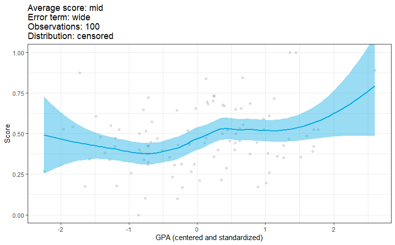
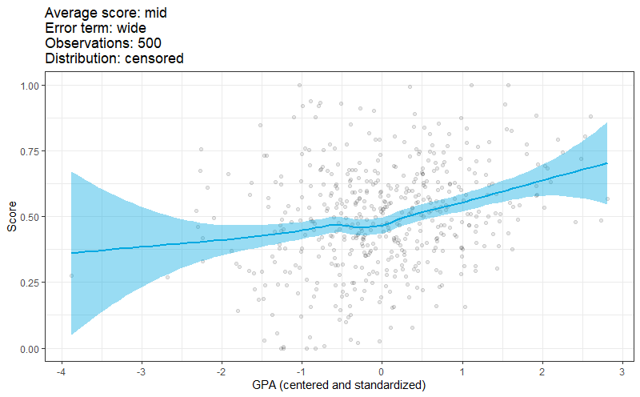
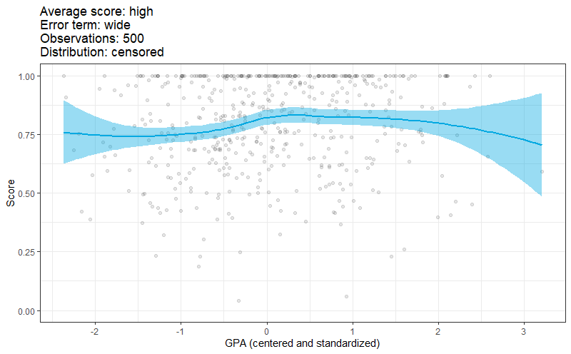
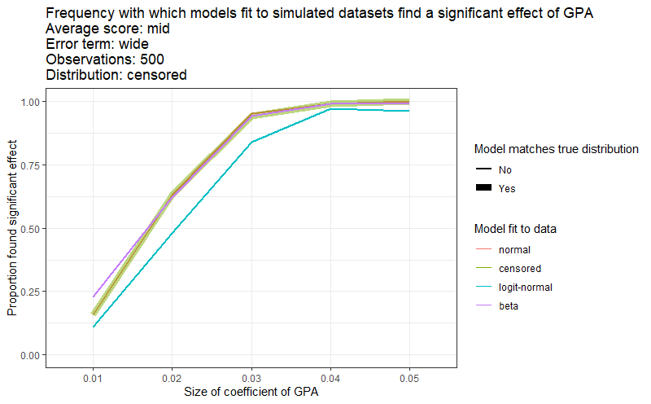

layout: true

<div class="my-footer"><span>https://github.com/kaplanas/nonstandard-regression</span></div> 

---

```{r setup, include = F}
library(tidyverse)
options(htmltools.dir.version = F)
knitr::opts_chunk$set(message = F, warning = F, error = F, echo = F)
blues = c("#00A8E1", "#009CDE", "#0077C8", "#003865", "#BCDDF4")
yellows = c("#FFCD00", "#EAAA00", "#CC8A00", "#833921", "#FFEFBD")
theme_set(theme_bw() +
            theme(axis.text = element_text(size = 15),
                  axis.title.x = element_text(size = 20,
                                              margin = margin(t = 15)),
                  axis.title.y = element_text(size = 20,
                                              margin = margin(r = 15)),
                  strip.text = element_text(size = 15)))
```

```{r load, include = F}
exams.df = read.csv("fake_dataset.csv", header = T, stringsAsFactors = F) %>%
  mutate(exam.grade = fct_relevel(case_when(exam.raw > 90 ~ "A",
                                            exam.raw > 80 ~ "B",
                                            exam.raw > 70 ~ "C",
                                            exam.raw > 60 ~ "D",
                                            T ~ "F"),
                                  "F", "D", "C", "B", "A"),
         days = fct_relevel(days, "Online", "MWF", "TR")) %>%
  rownames_to_column("student.id") %>%
  mutate(battery = (battery.raw - mean(battery.raw)) / sd(battery.raw),
         followers = (log(followers.raw + 100) -
                        mean(log(followers.raw + 100))) /
                     sd(log(followers.raw + 100)),
         test.1 = (test.1.raw - mean(test.1.raw)) / sd(test.1.raw),
         test.2 = (test.2.raw - mean(test.2.raw)) / sd(test.2.raw),
         test.3 = (test.3.raw - mean(test.3.raw)) / sd(test.3.raw))
```

```{r xaringan-themer, include = F}
library(xaringanthemer)
duo_accent(primary_color = blues[1], secondary_color = yellows[5])
```

class: inverse, center, middle

# Outline

---

# Outline

+ Types of dependent variables

+ Working dataset

+ Bounded dependent variables

    + Classical linear regression
    + Censored regression
    + Logit-normal regression
    + Beta regression

+ Ordered discrete dependent variables

    + Classical linear regression
    + Ordered logistic regression

+ Unordered discrete dependent variables

    + Multinomial logistic regression

---

class: inverse, center, middle

# Types of dependent variables

---

# Types of dependent variables

+ Bounded dependent variables

    + Test score
    + GPA
    + Section fill percentage

--

+ Ordered discrete dependent variables

    + Letter grade
    + Likert response (strongly agree, somewhat agree, ...)

--

+ Unordered discrete dependent variables

    + Choice of section
    + Choice of course
    + Choice of major
    + Choice of...

---

class: inverse, center, middle

# Dataset: Final exams

---

# Dataset: Final exams

+ Students enrolled in Underwater Basket-Weaving 101

--

+ This is fake data, but realistic

    + Similar things happen when we fit the same models to real datasets
    + (Different variables, but the same idea)

--

+ Dependent variables:

    + Final exam score _(0 - 100)_
    + Final exam grade _(A, B, C, D, F)_
    + Class meeting days _(MWF, TR, Online)_

--

+ Predictor variables:

    + Phone battery charge before exam _(0 - 100, centered and standardized)_
    + Number of Twitter followers _(logged, centered, and standardized)_
    + Luke Skywalker or Han Solo? _(binary)_
    + Left-handed? _(binary)_
    + Tests 1, 2, 3 scores _(0 - 100, centered and standardized)_

---

# Dataset: Final exams

.center[
```{r exam_score_distribution}
exams.df %>%
  ggplot(aes(x = exam.raw)) +
  geom_histogram() +
  scale_x_continuous("Final exam score") +
  scale_y_continuous("Number of observations")
```
]

---

class: inverse, center, middle

# Linear regression

---

# Classical linear regression

```{r normal_df, include = F}
normal.df = data.frame(x = c(0.5, runif(50, 0, 0.48), runif(50, 0.52, 1))) %>%
  mutate(alpha = c(1, rep(0.5, 100)),
         y = 1 + (2 * x) + c(0.3, rnorm(n() - 1, 0, 0.4)),
         resid = y - (1 + (2 * x)))
```

.pull-left[
$$y_i = \alpha + \beta x_i + \epsilon_i$$
```{r normal_regression, fig.height = 6, fig.width = 6}
normal.df %>%
  ggplot(aes(x = x, y = y)) +
  geom_point(aes(alpha = alpha), size = 3) +
  geom_hline(yintercept = 0) +
  geom_vline(xintercept = 0) +
  geom_abline(slope = 2, intercept = 1) +
  geom_segment(x = 0.5, xend = 0.5, y = 0, yend = 1, size = 2,
               color = yellows[1]) +
  annotate("label", x = 0.4, y = 0.5, label = expression(alpha),
           size = 7, color = yellows[1]) +
  geom_segment(x = 0.5, xend = 0.5, y = 1, yend = 2, size = 2,
               color = blues[1]) +
  annotate("label", x = 0.4, y = 1.5, label = expression(beta*x),
           size = 7, color = blues[1]) +
  geom_segment(x = 0.5, xend = 0.5, y = 2, yend = 2.3, size = 2,
               color = yellows[4]) +
  annotate("label", x = 0.4, y = 2.15, label = expression(epsilon),
           size = 7, color = yellows[4]) +
  scale_x_continuous() +
  scale_y_continuous() +
  scale_alpha_identity() +
  theme(panel.border = element_blank(),
        axis.ticks = element_blank())
```
]

--

.pull-right[
$$\epsilon_i \sim N(0, \sigma)$$
```{r normal_regression_residuals, fig.height = 6, fig.width = 6}
normal.df %>%
  ggplot(aes(x = resid)) +
  geom_histogram(breaks = seq(-1, 1, 0.25),
                 fill = yellows[4]) +
  stat_function(fun = function(x) {
                        dnorm(x, mean = 0, sd = 0.4) * nrow(normal.df) * 0.25
                      },
                size = 2) +
  scale_x_continuous(expression(epsilon)) +
  scale_y_continuous("Number of data points")
```
]

--

.center[.large[
$$y_i \sim N(\alpha + \beta x_i, \sigma)$$
]]

---

# Classical linear regression: No limits on y

.pull-left[
$$y_i \sim N(\alpha + \beta x_i, \sigma)$$
```{r normal_regression_no_limits, fig.height = 6, fig.width = 6}
normal.df %>%
  ggplot(aes(x = x, y = y)) +
  geom_point(size = 2, alpha = 0.5) +
  geom_hline(yintercept = 0) +
  geom_vline(xintercept = 0) +
  geom_abline(slope = 2, intercept = 1) +
  scale_x_continuous(limits = c(-2, 5)) +
  scale_y_continuous(limits = c(-3, 11)) +
  theme(panel.border = element_blank(),
        axis.ticks = element_blank())
```
]

--

.pull-right[

+ Extrapolating so far beyond the support of the data is not a good idea
{{content}}

]

--

+ But there are scenarios where it's easy to predict impossible values of y
{{content}}

--

+ Example: hard limits on y, data near those limits
    + Test scores
    + GPA
    + Section fill rates
{{content}}

---

# Fitting a classical linear regression

```{r normal_fit, echo = T}
normal.fit = lm(exam.raw ~ battery + followers + skywalker + left +
                  test.1 + test.2 + test.3,
                data = exams.df)
round(coef(summary(normal.fit)), 4)
```

---

# Predictions of a classical linear regression

```{r get_normal_preds, echo = T}
exams.df = exams.df %>%
  mutate(pred.normal = normal.fit$fitted.values,
         pred.normal.out.of.bounds = pred.normal > 100 |
                                     pred.normal < 0) %>%
  mutate(pred.normal = case_when(pred.normal > 100 ~ 100,
                                 pred.normal < 0 ~ 0,
                                 T ~ pred.normal),
         resid.normal = exam.raw - pred.normal)
```

---

# Predictions of a classical linear regression

.center[
```{r plot_normal_preds, fig.height = 6, fig.width = 9}
exams.df %>%
  mutate(alert = pred.normal > 100 | pred.normal < 0) %>%
  ggplot(aes(x = pred.normal, y = exam.raw,
             color = pred.normal.out.of.bounds,
             alpha = pred.normal.out.of.bounds)) +
  geom_point() +
  geom_abline(slope = 1, intercept = 0, color = blues[1]) +
  geom_hline(yintercept = 0) +
  geom_vline(xintercept = 0) +
  scale_x_continuous("Predicted final exam score",
                     limits = c(0, 100)) +
  scale_y_continuous("Observed final exam score",
                     limits = c(-10, 100)) +
  scale_color_manual("Prediction outside 0-100",
                     labels = c("No", "Yes"),
                     values = c("black", "red")) +
  scale_alpha_manual("Prediction outside 0-100",
                     labels = c("No", "Yes"),
                     values = c(0.2, 1)) +
  theme(panel.border = element_blank(),
        axis.ticks = element_blank())
```
]

---

class: inverse, center, middle

# Censored regression

---

# Censored regression

$$z_i: \mbox{student's true knowledge/ability}$$

$$z_i \sim N(\alpha + \beta x_i, \sigma)$$

$$y_i = \Bigg\{\begin{array}{ll} 100 & z_i \geq 100 \\ 0 & z_i \leq 0 \\ z_i & 0 \lt z_i \lt 100 \end{array}$$

.center[
```{r plot_censored_function, fig.height = 4, fig.width = 6}
data.frame(z = seq(-50, 150, 0.1)) %>%
  mutate(y = case_when(z > 100 ~ 100,
                       z < 0 ~ 0,
                       T ~ z)) %>%
  ggplot(aes(x = z, y = y)) +
  geom_line() +
  scale_x_continuous("z") +
  scale_y_continuous("y")
```
]

---

# Censored normal distributions

.center[
```{r plot_censored_distributions, fig.height = 6, fig.width = 10}
expand.grid(
  mean = seq(20, 80, 20),
  sd = seq(10, 30, 5),
  obs = 1:10000
) %>%
  mutate(z = rnorm(n(), mean, sd),
         y = case_when(z > 100 ~ 100,
                       z < 0 ~ 0,
                       T ~ z)) %>%
  mutate(sd.label = paste("sigma == '", sd, "'", sep = ""),
         mean.label = paste("alpha + beta*x == '", mean, "'", sep = "")) %>%
  ggplot(aes(x = y)) +
  geom_histogram() +
  scale_x_continuous("y") +
  scale_y_continuous("") +
  facet_grid(mean.label ~ sd.label, scales = "free",
             labeller = "label_parsed") +
  theme(axis.ticks.y = element_blank(),
        axis.text.y = element_blank())
```
]

---

# Fitting a censored regression

```{r censored_fit, echo = T}
library(censReg)
censored.fit = censReg(exam.raw ~ battery + followers + skywalker +
                         left + test.1 + test.2 + test.3,
                       left = 0, right = 100, data = exams.df)
round(coef(summary(censored.fit)), 4)
```

---

# Predictions of a censored regression

```{r get_censored_preds, echo = T}
predictors = c("battery", "followers", "skywalker", "left",
               "test.1", "test.2", "test.3")
exams.df$pred.censored = c(
  as.matrix(cbind(rep(1, nrow(exams.df)), exams.df[,predictors]))
  %*%
  summary(censored.fit)$estimate[c("(Intercept)",
                                   predictors),"Estimate"]
)
exams.df = exams.df %>%
  mutate(pred.censored = case_when(pred.censored > 100 ~ 100,
                                   pred.censored < 0 ~ 0,
                                   T ~ pred.censored),
         resid.censored = exam.raw - pred.censored)
```

---

# Predictions of a censored regression

.center[
```{r plot_censored_preds, fig.height = 6, fig.width = 6}
exams.df %>%
  ggplot(aes(x = pred.censored, y = exam.raw)) +
  geom_point(alpha = 0.2) +
  geom_abline(slope = 1, intercept = 0, color = blues[1]) +
  geom_hline(yintercept = 0) +
  geom_vline(xintercept = 0) +
  scale_x_continuous("Predicted final exam score",
                     limits = c(0, 100)) +
  scale_y_continuous("Observed final exam score",
                     limits = c(0, 100)) +
  theme(legend.position = "none",
        panel.border = element_blank(),
        axis.ticks = element_blank())
```
]

---

class: inverse, center, middle

# Logit-normal regression

---

# Logit-normal regression

$$z_i: \mbox{student's true knowledge/ability}$$

$$z_i \sim N(\alpha + \beta x_i, \sigma)$$

$$\frac{y_i}{100} = \mbox{logit}^{-1}(z_i)$$

.center[
```{r plot_invlogit_function, fig.height = 5, fig.width = 8}
library(logitnorm)
data.frame(z = seq(-5, 5, 0.01)) %>%
  mutate(y = invlogit(z)) %>%
  ggplot(aes(x = z, y = y)) +
  geom_line() +
  scale_x_continuous("z") +
  scale_y_continuous(expression(frac(y, 100)))
```
]

---

# Logit-normal distributions

.center[
```{r plot_logit_distributions, fig.height = 6.5, fig.width = 10}
library(logitnorm)
expand.grid(
  mean = seq(-4, 4, 2),
  sd = seq(0.2, 1, 0.2),
  obs = 1:10000
) %>%
  mutate(z = rnorm(n(), mean, sd),
         y = invlogit(z)) %>%
  mutate(sd.label = paste("sigma == '", sd, "'", sep = ""),
         mean.label = fct_reorder(paste("alpha + beta*x == '", mean, "'",
                                        sep = ""),
                                  mean, max)) %>%
  ggplot(aes(x = y)) +
  geom_histogram() +
  scale_x_continuous(expression(frac(y, 100))) +
  scale_y_continuous("") +
  facet_grid(mean.label ~ sd.label, scales = "free",
             labeller = "label_parsed") +
  theme(axis.ticks.y = element_blank(),
        axis.text.y = element_blank(),
        axis.text.x = element_text(size = 10))
```
]

---

# Adjusting y for a logit-normal regression

+ Divide $y$ by 100 to bound it between 0 and 1

+ $y$ can't be exactly 0 or 1 (the logit is infinite), so offset those values slightly

```{r adjust_y, echo = T}
score.offset = 0.0001
exams.df = exams.df %>%
  mutate(exam.raw.offset = case_when(exam.raw / 100 == 1 ~
                                       1 - score.offset,
                                     exam.raw / 100 == 0 ~
                                       score.offset,
                                     T ~ exam.raw / 100))
```

---

# Fitting a logit-normal regression: Method 1

```{r logit_1_fit_dummy, eval = F, echo = T}
library(gamlss)
logit.1.fit = gamlss(exam.raw.offset ~ battery + followers +
                       skywalker + left + test.1 + test.2 + test.3,
                     data = exams.df, family = LOGITNO(),
                     control = gamlss.control(trace = F))
summary(logit.fit)
```

```{r logit_1_fit, include = F}
library(gamlss)
logit.1.fit = gamlss(exam.raw.offset ~ battery + followers +
                       skywalker + left + test.1 + test.2 + test.3,
                     data = exams.df, family = LOGITNO(),
                     control = gamlss.control(trace = F))
logit.1.fit.summary = summary(logit.1.fit)
```

```{r print_logit_1_fit}
round(logit.1.fit.summary, 4)
```

---

# Predictions of a logit-normal regression: Method 1

```{r get_logit_1_preds, echo = T}
exams.df = exams.df %>%
  mutate(pred.logit.1 = fitted(logit.1.fit) * 100,
         resid.logit.1 = exam.raw - pred.logit.1)
```

.center[
```{r plot_logit_1_preds, fig.height = 5, fig.width = 6}
exams.df %>%
  ggplot(aes(x = pred.logit.1, y = exam.raw)) +
  geom_point(alpha = 0.2) +
  geom_abline(slope = 1, intercept = 0, color = blues[1]) +
  geom_hline(yintercept = 0) +
  geom_vline(xintercept = 0) +
  scale_x_continuous("Predicted final exam score",
                     limits = c(0, 100)) +
  scale_y_continuous("Observed final exam score",
                     limits = c(0, 100)) +
  theme(legend.position = "none",
        panel.border = element_blank(),
        axis.ticks = element_blank())
```
]

---

# Fitting a logit-normal regression: Method 2

```{r logit_2_fit, echo = T}
library(logitnorm)
logit.2.fit = lm(logit(exam.raw.offset) ~ battery + followers +
                   skywalker + left + test.1 + test.2 + test.3,
                 data = exams.df)
round(coef(summary(logit.2.fit)), 4)
```

---

# Predictions of a logit-normal regression: Method 2

```{r get_logit_2_preds, echo = T}
exams.df = exams.df %>%
  mutate(pred.logit.2 = invlogit(unname(logit.2.fit$fitted.values))
                        * 100,
         resid.logit.2 = exam.raw - pred.logit.2)
```

---

# Predictions of a logit-normal regression: Method 2

.center[
```{r plot_logit_2_preds, fig.height = 5, fig.width = 6}
exams.df %>%
  ggplot(aes(x = pred.logit.2, y = exam.raw)) +
  geom_point(alpha = 0.2) +
  geom_abline(slope = 1, intercept = 0, color = blues[1]) +
  geom_hline(yintercept = 0) +
  geom_vline(xintercept = 0) +
  scale_x_continuous("Predicted final exam score",
                     limits = c(0, 100)) +
  scale_y_continuous("Observed final exam score",
                     limits = c(0, 100)) +
  theme(legend.position = "none",
        panel.border = element_blank(),
        axis.ticks = element_blank())
```
]

---

class: inverse, center, middle

# Beta regression

---

# Beta regression

$$z_i: \mbox{student's true knowledge/ability}$$

$$z_i = \alpha + \beta x_i$$

$$\mu_i = \mbox{logit}^{-1}(z_i)$$

$$\frac{y_i}{100} \sim \mbox{Beta}(\mu_i \phi, (1 - \mu_i) \phi)$$

---

# Beta distributions

.center[
```{r plot_beta_distributions, fig.height = 6.5, fig.width = 10}
expand.grid(
  mu = seq(0.2, 0.8, 0.2),
  phi = seq(1, 5, 1),
  obs = 1:10000
) %>%
  mutate(y = rbeta(n(), mu * phi, (1 - mu) * phi)) %>%
  mutate(phi.label = paste("phi == '", phi, "'", sep = ""),
         mu.label = paste("mu == '", mu, "'", sep = "")) %>%
  ggplot(aes(x = y)) +
  geom_histogram() +
  scale_x_continuous(expression(frac(y, 100))) +
  scale_y_continuous("") +
  facet_grid(mu.label ~ phi.label, scales = "free",
             labeller = "label_parsed") +
  theme(axis.ticks.y = element_blank(),
        axis.text.y = element_blank(),
        axis.text.x = element_text(size = 10))
```
]

---

# Fitting a beta regression

```{r beta_fit, echo = T}
library(betareg)
beta.fit = betareg(exam.raw.offset ~ battery + followers +
                     skywalker + left + test.1 + test.2 + test.3,
                   data = exams.df,
                   link = "logit", link.phi = "log")
round(coef(summary(beta.fit))$mean, 4)
```

---

# Predictions of a beta regression

```{r get_beta_preds, echo = T}
exams.df = exams.df %>%
  mutate(pred.beta = unname(beta.fit$fitted.values) * 100,
         resid.beta = exam.raw - pred.beta)
```

.center[
```{r plot_beta_preds, fig.height = 5, fig.width = 6}
exams.df %>%
  ggplot(aes(x = pred.beta, y = exam.raw)) +
  geom_point(alpha = 0.2) +
  geom_abline(slope = 1, intercept = 0, color = blues[1]) +
  geom_hline(yintercept = 0) +
  geom_vline(xintercept = 0) +
  scale_x_continuous("Predicted final exam score",
                     limits = c(0, 100)) +
  scale_y_continuous("Observed final exam score",
                     limits = c(0, 100)) +
  theme(legend.position = "none",
        panel.border = element_blank(),
        axis.ticks = element_blank())
```
]

---

class: inverse, center, middle

# Comparing regression types

---

# Comparing regression types: Parameter estimates

.center[
```{r plot_parameters, fig.height = 6, fig.width = 8}
bind_rows(
  normal = data.frame(coef(summary(normal.fit))[2:(length(predictors)+1),c("Estimate", "Std. Error")]) %>%
    rownames_to_column("parameter"),
  censored = data.frame(coef(summary(censored.fit))[2:(length(predictors)+1),c("Estimate", "Std. error")]) %>%
    rownames_to_column("parameter") %>%
    dplyr::select(parameter, Estimate, Std..Error = Std..error),
  logit.normal = data.frame(logit.1.fit.summary[2:(length(predictors)+1),c("Estimate", "Std. Error")]) %>%
    rownames_to_column("parameter"),
  beta = data.frame(coef(summary(beta.fit))[["mean"]][2:(length(predictors)+1),c("Estimate", "Std. Error")]) %>%
    rownames_to_column("parameter"),
  .id = "model"
) %>%
  mutate(model = fct_relevel(gsub("\\.", "-", model),
                             "normal", "censored", "logit-normal", "beta"),
         parameter = fct_relevel(parameter, "battery", "followers",
                                 "skywalker", "left", "exam.1", "exam.2",
                                 "exam.3"),
         parameter = fct_rev(parameter)) %>%
  ggplot(aes(x = parameter, y = Estimate)) +
  geom_point(size = 3, color = blues[1]) +
  geom_linerange(aes(ymin = Estimate + (qnorm(0.25) * Std..Error),
                     ymax = Estimate + (qnorm(0.75) * Std..Error)),
                 size = 2, color = blues[1]) +
  geom_linerange(aes(ymin = Estimate + (qnorm(0.975) * Std..Error),
                     ymax = Estimate + (qnorm(0.025) * Std..Error)),
                 color = blues[1]) +
  geom_hline(yintercept = 0) +
  scale_x_discrete("Parameter") +
  facet_wrap(~ model, scales = "free_x") +
  coord_flip()
```
]

---

# Comparing regression types: Predictions

.center[
```{r plot_predictions, fig.height = 7, fig.width = 10}
library(GGally)
exams.df %>%
  dplyr::select(normal = pred.normal, censored = pred.censored,
                `logit-normal` = pred.logit.1, beta = pred.beta) %>%
  ggpairs(lower = list(continuous = wrap(
    function(data, mapping) {
      ggplot(data = data, mapping = mapping) +
        geom_point() +
        geom_abline(slope = 1, intercept = 0, color = blues[1])
    }
  )))
```
]

---

# Comparing regression types: Residuals

.center[
```{r plot_residuals, fig.height = 7, fig.width = 10}
exams.df %>%
  dplyr::select(-ends_with(".stan")) %>%
  pivot_longer(cols = starts_with("resid."),
               names_to = "model",
               names_prefix = "resid.",
               values_to = "resid") %>%
  filter(model != "logit.2" & !grepl("bounds", model)) %>%
  mutate(model = ifelse(model == "logit.1", "logit-normal", model),
         model = fct_relevel(model, "normal", "censored", "logit-normal", "beta"),
         model = fct_rev(model)) %>%
  ggplot(aes(x = model, y = resid)) +
  geom_violin(color = yellows[4], fill = yellows[4]) +
  geom_boxplot(color = "white", width = 0.1, outlier.alpha = 0) +
  stat_summary(fun.y = "median", geom = "point", color = yellows[4]) +
  scale_x_discrete("Model") +
  scale_y_continuous("Residual") +
  coord_flip()
```
]

---

# Comparing regression types: Simulated datasets

+ I simulated score as a function of "GPA" with known parameters

+ Simulations varied along several dimensions

    + Average score: mid (0.5), high (0.8)
    
    + Standard deviation of scores: narrow (0.2), wide (0.5)
    
    + Number of observations: 100, 500
    
    + Strength of association between GPA and score (5 steps)
    
    + Distribution that generated score from GPA (censored, logit-normal, beta)

+ 100 simulated datasets per simulation type; fit four models to each

---

# Comparing regression types: Simulated datasets

.center[
```{r simulated_dataset_mid_wide_100, out.width = "80%"}

```
]

---

# Comparing regression types: Simulated datasets

.center[
```{r simulated_dataset_mid_wide_500, out.width = "80%"}

```
]

---

# Comparing regression types: Simulated datasets

.center[
```{r simulated_dataset_high_wide_500, out.width = "80%"}

```
]

---

# Comparing regression types: Simulated datasets

.center[
```{r simulated_dataset_high_narrow_500, out.width = "80%"}

```
]

---

# Comparing regression types: Simulated datasets

.center[
```{r simulated_datasets, out.width = "80%"}
knitr::include_graphics("images/simulated_datasets.png")
```
]

---

# Comparing regression types: Simulated datasets

.center[
```{r significant_effects_mid_wide_500, out.width = "80%"}

```
]

---

# Comparing regression types: Simulated datasets

.center[
```{r significant_effects, out.width = "90%"}
knitr::include_graphics("images/significant_effects.png")
```
]

---

# Comparing regression types: Simulated datasets

.center[
```{r residuals, out.width = "100%"}
knitr::include_graphics("images/residuals.png")
```
]

---

class: inverse, center, middle

# Ordered logistic regression

---

# Discrete ordered responses

.center[
```{r plot_grades}
exams.df %>%
  ggplot(aes(x = exam.grade)) +
  geom_bar() +
  scale_x_discrete("Final exam grade") +
  scale_y_continuous("Number of observations")
```
]

---

# Fitting a classical linear regression

```{r discrete_normal_fit, echo = T}
discrete.normal.fit = lm(as.numeric(exam.grade) ~ battery +
                           followers + skywalker + left + test.1 +
                           test.2 + test.3,
                         data = exams.df)
round(coef(summary(discrete.normal.fit)), 4)
```

---

# Predictions of a classical linear regression

```{r get_discrete_normal_preds, echo = T}
exams.df$pred.discrete.normal =
  round(discrete.normal.fit$fitted.values)
```

.center[
```{r plot_discrete_normal_preds, fig.height = 5, fig.width = 6}
exams.df %>%
  mutate(alert = pred.discrete.normal > 5 | pred.discrete.normal < 1) %>%
  ggplot(aes(x = exam.grade, y = pred.discrete.normal,
             color = alert)) +
  geom_jitter(alpha = 0.2) +
  geom_abline(slope = 1, intercept = 0, color = blues[1]) +
  geom_hline(yintercept = 0) +
  geom_vline(xintercept = 0) +
  scale_x_discrete("Observed final exam grade") +
  scale_y_continuous("Predicted final exam grade",
                     breaks = -1:5,
                     labels = c("-1", "0",
                                levels(exams.df$exam.grade))) +
  scale_color_manual(values = c("black", "red")) +
  theme(legend.position = "none",
        panel.border = element_blank(),
        axis.ticks = element_blank())
```
]

---

# Logistic regression

$$z_i: \mbox{student's performance}$$

$$z_i \sim \mbox{Logistic}(\alpha + \beta x_i)$$

$$y_i: \mbox{whether the student passed}$$

$$P(y_i = 1) = P(z_i > 0)$$

.center[
```{r logistic_regression_schema, fig.height = 4.5, fig.width = 7}
data.frame(z = seq(-5, 5, 0.01)) %>%
  mutate(d = dlogis(z - 1)) %>%
  ggplot(aes(x = z,
             y = d)) +
  geom_area(stat = "function", fun = function(x) { dlogis(x - 1) },
            fill = "gray", xlim = c(0, 5)) +
  geom_line() +
  geom_vline(xintercept = 0) +
  annotate("label", x = 1.3, y = 0.1,
           label = eval(bquote(expression(P(z[i] > 0) == .(round(plogis(1), 2)))))) +
  scale_x_continuous(expression(alpha + beta*x[i])) +
  scale_y_continuous("")
```
]

---

# Ordered logistic regression

$$z_i: \mbox{student's performance}$$

$$z_i \sim \mbox{Logistic}(\alpha + \beta x_i)$$

$$y_i: \mbox{student's grade}$$

$$P(y_i = B) = P(z_i > c_{C|B} \mbox{ and } z_i <= c_{B|A})$$

.center[
```{r ordered_logistic_regression_schema, fig.height = 4.5, fig.width = 7}
data.frame(z = seq(-5, 5, 0.01)) %>%
  mutate(d = dlogis(z - 1)) %>%
  ggplot(aes(x = z,
             y = d)) +
  geom_area(stat = "function", fun = function(x) { dlogis(x - 1) },
            fill = "gray", xlim = c(-0.5, 2)) +
  geom_line() +
  geom_vline(xintercept = c(-3, -2, -0.5, 2)) +
  annotate("label", x = 0.7, y = 0.1,
           label = eval(bquote(expression(P(y[i] == B) == .(round(plogis(2) - plogis(-0.5), 2)))))) +
  scale_x_continuous(expression(z[i] == alpha + beta*x[i]),
                     breaks = c(-3, -2, -0.5, 2),
                     labels = c("F|D", "D|C", "C|B", "B|A")) +
  scale_y_continuous("") +
  theme(panel.grid.minor.x = element_blank())
```
]

---

# Fitting an ordered logistic regression

```{r ordered_logistic_fit, echo = T}
library(MASS)
ordered.logistic.fit = polr(exam.grade ~ battery + followers +
                              skywalker + left + test.1 + test.2 +
                              test.3,
                            data = exams.df)
round(coef(summary(ordered.logistic.fit)), 4)
```

---

# Predictions of an ordered logistic regression

```{r get_ordered_logistic_preds, echo = T}
exams.df$pred.ordered.logistic = apply(
  ordered.logistic.fit$fitted.values,
  1,
  function(x) { c("F", "D", "C", "B", "A")[which(x == max(x))] }
) %>%
  fct_relevel("F", "D", "C", "B", "A")
```

---

# Predictions of an ordered logistic regression

.center[
```{r plot_ordered_logistic_preds, fig.height = 5, fig.width = 6}
exams.df %>%
  ggplot(aes(x = exam.grade, y = pred.ordered.logistic)) +
  geom_jitter(alpha = 0.2) +
  geom_abline(slope = 1, intercept = 0, color = blues[1]) +
  geom_hline(yintercept = 0) +
  geom_vline(xintercept = 0) +
  scale_x_discrete("Observed final exam grade") +
  scale_y_discrete("Predicted final exam grade") +
  theme(legend.position = "none",
        panel.border = element_blank(),
        axis.ticks = element_blank())
```
]

---

# Latent variable and actual scores

```{r get_ordered_logistic_latent, echo = T}
exams.df$latent.ordered.logistic = ordered.logistic.fit$lp
```

.center[
```{r plot_ordered_logistic_latent, fig.height = 6, fig.width = 8}
cutpoints.df = coef(summary(ordered.logistic.fit)) %>%
  data.frame() %>%
  rownames_to_column("parameter") %>%
  filter(grepl("\\|", parameter)) %>%
  mutate(real.value = case_when(parameter == "F|D" ~ 60,
                                parameter == "D|C" ~ 70,
                                parameter == "C|B" ~ 80,
                                parameter == "B|A" ~ 90))
library(fuzzyjoin)
exams.df %>%
  ggplot(aes(x = exam.raw, y = latent.ordered.logistic)) +
  geom_point(alpha = 0.2) +
  geom_vline(data = cutpoints.df,
             aes(xintercept = real.value), color = yellows[1]) +
  geom_hline(data = cutpoints.df,
             aes(yintercept = Value), color = yellows[1]) +
  stat_smooth(color = blues[1], fill = blues[1]) +
  geom_label(data = cutpoints.df %>%
              regex_inner_join(data.frame(g = LETTERS[1:5]),
                               by = c(parameter = "g")) %>%
              group_by(g) %>%
              summarize(max.x = max(real.value),
                        min.x = min(real.value),
                        max.y = max(Value),
                        min.y = min(Value)) %>%
              ungroup() %>%
              mutate(max.x = ifelse(g == "A", 100, max.x),
                     min.x = ifelse(g == "F", 0, min.x),
                     max.y = ifelse(g == "A", max(exams.df$latent.ordered.logistic), max.y),
                     min.y = ifelse(g == "F", min(exams.df$latent.ordered.logistic), min.y)),
            aes(x = min.x + ((max.x - min.x) / 2),
                y = min.y + ((max.y - min.y) / 2),
                label = g),
            color = "black", fill = yellows[1], size = 5) +
  scale_x_continuous("Final exam score") +
  scale_y_continuous("z")
```
]

---

class: inverse, center, middle

# Multinomial logistic regression

---

# Discrete unordered responses

.center[
```{r plot_days}
exams.df %>%
  ggplot(aes(x = days)) +
  geom_bar() +
  scale_x_discrete("Meeting pattern") +
  scale_y_continuous("Number of observations")
```
]

---

# Multinomial logistic regression

$$z_{ik}: \mbox{propensity of observation } i \mbox{ to fall into category } k$$

$$z_{ik} = \Bigg\{\begin{array}{ll} 0 & k = 1 \\ \alpha_k + \beta_k x_{ik} & k > 1 \end{array}$$

$$P(y_i = k) = \frac{e^{z_{ik}}}{\sum_{k = 1}^K e^{z_{ik}}}$$

---

# Multinomial logistic regression

```{r multi_fit, include = F}
library(nnet)
multi.fit = multinom(days ~ battery + followers + skywalker + left,
                     data = exams.df)
```

```{r plot_multi_schema, fig.height = 7, fig.width = 7, fig.align = "center", echo = F}
rbind(0, coef(multi.fit) %*%
        rbind(1, t(exams.df[509,c("battery", "followers", "skywalker", "left")]))) %>%
  data.frame() %>%
  setNames("z") %>%
  rownames_to_column("days") %>%
  mutate(days = fct_rev(fct_relevel(ifelse(days == "", "Online", days),
                                    "MWF", "TR", "S", "Online")),
         exp.z = exp(z),
         p = exp.z / sum(exp.z)) %>%
  pivot_longer(cols = c("z", "exp.z", "p"),
               names_to = "unit", values_to = "value") %>%
  mutate(unit = fct_relevel(case_when(unit == "z" ~ "z[i]",
                                      unit == "exp.z" ~ "e^z[i]",
                                      unit == "p" ~ "P(y[i] == k)",
                                      T ~ unit),
                            "z[i]", "e^z[i]", "p[i]")) %>%
  ggplot(aes(x = value, y = days)) +
  geom_point(size = 3) +
  scale_x_continuous("") +
  scale_y_discrete("") +
  facet_wrap(~ unit, ncol = 1, scales = "free", labeller = label_parsed)
```

---

# Fitting a multinomial logistic regression

```{r multi_fit_dummy, eval = F, echo = T}
# Fit a model in R.
library(nnet)
multi.fit = multinom(days ~ battery + followers + skywalker + left,
                     data = exams.df)
round(coef(summary(multi.fit)), 4)
```

---

# Predictions of a multinomial logistic regression

```{r multi_predictions, echo = T}
exams.df$pred.multi = apply(
  multi.fit$fitted.values,
  1,
  function(x) { c("Online", "MWF", "TR")[which(x == max(x))] }
) %>%
  fct_relevel("Online", "MWF", "TR")
```

---

# Predictions of a multinomial logistic regression

.center[
```{r plot_multi_preds, fig.height = 5, fig.width = 6, fig.align = "center"}
# Predictions from the R model.
exams.df %>%
  ggplot(aes(x = days, y = pred.multi)) +
  geom_jitter(alpha = 0.2) +
  scale_x_discrete("Observed meeting pattern") +
  scale_y_discrete("Predicted meeting pattern") +
  theme(legend.position = "none",
        panel.border = element_blank(),
        axis.ticks = element_blank())
```
]


