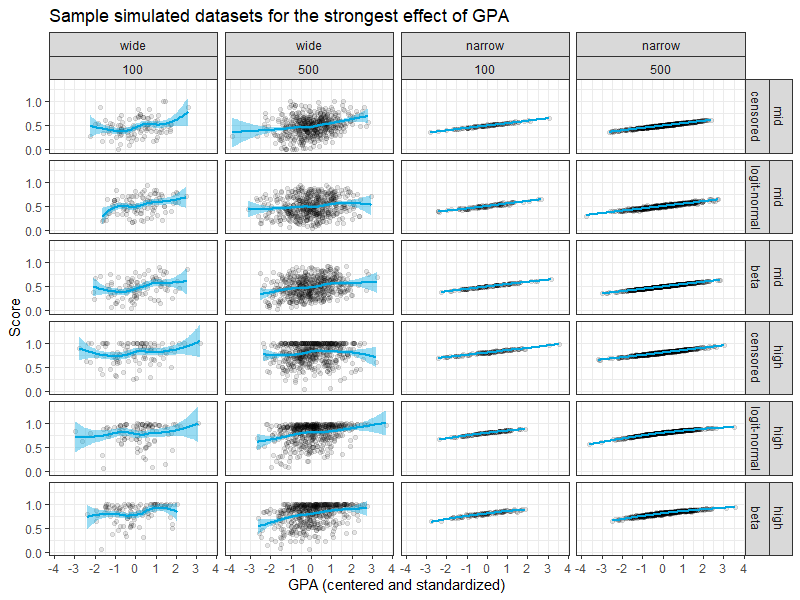
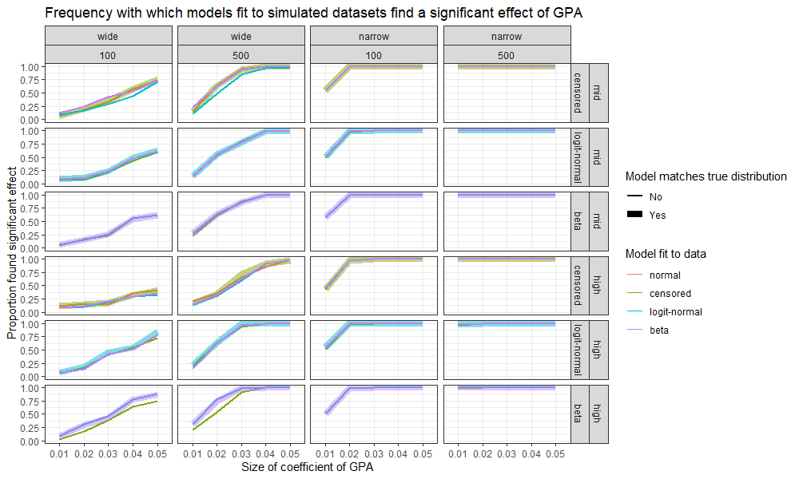
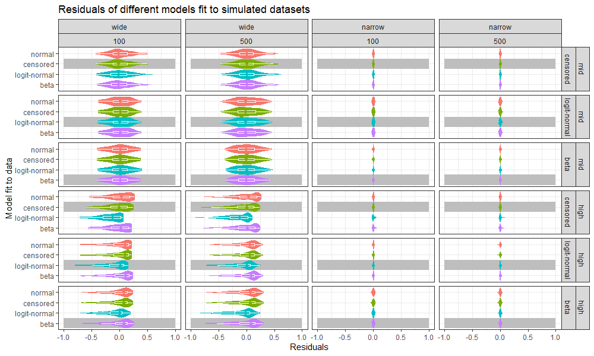

```{r setup, message = F, warning = F, error = F}
library(tidyverse)
if(params$eval.stan) {
  library(rstan)
  rstan_options(auto_write = T)
}
options(htmltools.dir.version = F)
knitr::opts_chunk$set(message = F, warning = F, error = F)
blues = c("#00A8E1", "#009CDE", "#0077C8", "#003865", "#BCDDF4")
yellows = c("#FFCD00", "#EAAA00", "#CC8A00", "#833921", "#FFEFBD")
theme_set(theme_bw() +
            theme(axis.text = element_text(size = 10),
                  axis.title.x = element_text(size = 12,
                                              margin = margin(t = 10)),
                  axis.title.y = element_text(size = 12,
                                              margin = margin(r = 10)),
                  strip.text = element_text(size = 10)))
```

# Non-standard dependent variables

Typical introductions to regression introduce two types of models, each with very specific expectations of its dependent variables.  **Linear regression** assumes that the dependent variable can take on any real value (in principle, depending on the observed values of the predictors).  **Logistic regression** is appropriate for binary dependent variables (yes/no, 1/0).

But in the real world, we often want to build regression models for dependent variables that don't fit into either of these two categories.  In the higher ed space, we commonly encounter dependent variables that are constrained in important ways:

+ Variables that are bounded on both sides
    + Score on a test with fixed minimum and maximum values
    + GPA
    + Section fill percentage
+ Discrete variables that are inherently ordered
    + Letter grade ("A", "B", "C", etc.)
    + Likert responses on a survey ("Strongly agree", "Somewhat agree", etc.)
+ Discrete variables that are not inherently ordered
    + Which major did the student choose?
    + Which course section did the student register for?

In what follows, we will review regression techniques for each of these types of dependent variables.  Sample code for each model shows a fit with an R package, plus Stan code for a fully customizable Bayesian implementation (using the `rstan` package to interface with R).  By default, this markdown document does *not* run the Stan models; to do so (if you're compiling the document yourself), use the `Knit with Parameters...` option and check `eval.stan`.

All code assumes you have loaded the `tidyverse`; other packages are introduced as needed.

# Working dataset

```{r load_data, class.source = "fold-show"}
exams.df = read.csv("fake_dataset.csv", header = T, stringsAsFactors = F) %>%
  mutate(days = fct_relevel(days, "Online", "MWF", "TR")) %>%
  rownames_to_column("student.id")
```

### Variables

Our working dataset consists of final exam scores for students enrolled in Underwater Basket-Weaving 101 at State U.  It includes the following predictor variables:

+ Phone battery charge before exam _(0 - 100)_
+ Number of Twitter followers
+ Does the student prefer Luke Skywalker or Han Solo? _(binary)_
+ Is the student left-handed? _(binary)_
+ Tests 1, 2, and 3 scores _(0 - 100)_

Final exam scores are bounded between 0 and 100.

```{r exam_score_distribution, fig.height = 3, fig.width = 6, fig.align = "center"}
exams.df %>%
  ggplot(aes(x = exam.raw)) +
  geom_histogram() +
  scale_x_continuous("Final exam score") +
  scale_y_continuous("Number of observations") +
  ggtitle("Distribution of final exam scores")
```

### Some initial cleaning

Before fitting any of the models below, let's center and standardize the continuous predictors.  Number of Twitter followers is (unsurprisingly) skewed right, so we'll take the log.

```{r center_standardize_log, class.source = "fold-show"}
exams.df = exams.df %>%
  mutate(battery = (battery.raw - mean(battery.raw)) / sd(battery.raw),
         followers = (log(followers.raw + 100) -
                        mean(log(followers.raw + 100))) /
                     sd(log(followers.raw + 100)),
         test.1 = (test.1.raw - mean(test.1.raw)) / sd(test.1.raw),
         test.2 = (test.2.raw - mean(test.2.raw)) / sd(test.2.raw),
         test.3 = (test.3.raw - mean(test.3.raw)) / sd(test.3.raw))
```

### Preparing the data for Stan

To fit models with Stan (as opposed to R), we need the data in a format that Stan can read.  All the Stan models below for final exam score accept a dataset in this form:

```{r stan_data_score, eval = params$eval.stan, class.source = "fold-show"}
score.stan.data = list(
  N = nrow(exams.df),
  I = 7,
  X = exams.df %>%
    dplyr::select(battery, followers, skywalker, left, test.1, test.2, test.3),
  y = exams.df$exam.raw
)
```

# Classical linear regression

A standard linear regression models $y_i$ as a linear function of the predictor variable(s) $x_i$, plus a normally distributed error term $\epsilon_i$.

```{r normal_df, echo = F}
normal.df = data.frame(x = c(0.5, runif(50, 0, 0.48), runif(50, 0.52, 1))) %>%
  mutate(alpha = c(1, rep(0.5, 100)),
         y = 1 + (2 * x) + c(0.3, rnorm(n() - 1, 0, 0.4)),
         resid = y - (1 + (2 * x)))
```

<div class = "row">

<div class = "col-md-6">

$$y_i = \alpha + \beta x_i + \epsilon_i$$

```{r normal_regression, fig.height = 3, fig.width = 5, fig.align = "center", echo = F}
normal.df %>%
  ggplot(aes(x = x, y = y)) +
  geom_point(aes(alpha = alpha), size = 3) +
  geom_hline(yintercept = 0) +
  geom_vline(xintercept = 0) +
  geom_abline(slope = 2, intercept = 1) +
  geom_segment(x = 0.5, xend = 0.5, y = 0, yend = 1, size = 2,
               color = yellows[1]) +
  annotate("label", x = 0.4, y = 0.5, label = expression(alpha),
           size = 7, color = yellows[1]) +
  geom_segment(x = 0.5, xend = 0.5, y = 1, yend = 2, size = 2,
               color = blues[1]) +
  annotate("label", x = 0.4, y = 1.5, label = expression(beta*x),
           size = 7, color = blues[1]) +
  geom_segment(x = 0.5, xend = 0.5, y = 2, yend = 2.3, size = 2,
               color = yellows[4]) +
  annotate("label", x = 0.4, y = 2.15, label = expression(epsilon),
           size = 7, color = yellows[4]) +
  scale_x_continuous() +
  scale_y_continuous() +
  scale_alpha_identity() +
  theme(panel.border = element_blank(),
        axis.ticks = element_blank())
```

</div>

<div class = "col-md-6">

$$\epsilon_i \sim N(0, \sigma)$$

```{r normal_regression_residuals, fig.height = 3, fig.width = 5, fig.align = "center", echo = F}
normal.df %>%
  ggplot(aes(x = resid)) +
  geom_histogram(breaks = seq(-1, 1, 0.25),
                 fill = yellows[4]) +
  stat_function(fun = function(x) {
                        dnorm(x, mean = 0, sd = 0.4) * nrow(normal.df) * 0.25
                      },
                size = 2) +
  scale_x_continuous(expression(epsilon)) +
  scale_y_continuous("Number of data points")
```

</div>

</div>

Equivalently, we can write $y_i$ as a normally distributed random variable whose mean is a linear function of $x_i$:

$$y_i \sim N(\alpha + \beta x_i, \sigma)$$

One implication of this model is that, in principle, there are no limits on possible values of $y$: given appropriate values of $x$, $y$ can take on any real value.  This property of the model may be undesirable if we happen to know that $y$ cannot take on certain values (for example, if we know that $y$ cannot be negative).

```{r normal_regression_no_limits, fig.height = 3, fig.width = 5, fig.align = "center", echo = F}
normal.df %>%
  ggplot(aes(x = x, y = y)) +
  geom_point(size = 2, alpha = 0.5) +
  geom_hline(yintercept = 0) +
  geom_vline(xintercept = 0) +
  geom_abline(slope = 2, intercept = 1) +
  scale_x_continuous(limits = c(-2, 5)) +
  scale_y_continuous(limits = c(-3, 11)) +
  theme(panel.border = element_blank(),
        axis.ticks = element_blank())
```

In practice, of course, the fact that the model is capable of predicting impossible values may not cause problems.  If we know that extreme values of $x$ are impossible too, then the issue simply won't come up.  (And even if extreme values of $x$ *are* possible, extrapolating too far beyond the attested observations is a decidedly bad idea.)

But if we have attested observations very close to the hard limits on $y$, then we very well may find ourselves in a situation where the classical model leads us to predict impossible values of $y$ for reasonable values of $x$.  Exam scores are a case in point: there are many observations at 0, and a sizeable number close to 100; we want to be able to predict attested values without predicting unattested ones.

Similarly, the classical model does not translate well to cases where $y$ consists of discrete ordered responses.  We can map each value of $y$ to a number and fit the model to those numbers (A = 4, B = 3, etc.), but we face the same problem that it's easy to predict "grades" that are impossibly small or large.  In addition, discrete ordered responses may not be equally spaced: in a given dataset, the "distance" between A and B may not be the same as the "distance" between B and C.  To the extent that this is true, the classical model is not appropriate.

# Bounded dependent variables

There are multiple techniques for building regression models for bounded dependent variables.  We will review four of them: classical linear regression, censored linear regression, logit-normal regression, and beta regression.  What all of the alternative models have in common is that they predict an unrestricted latent variable $z$ - representing the student's true knowledge and/or ability - as a function of $x$, and then map $z$ to the observed $y$ values.

### Classical linear regression {.tabset}

As shown in the graph of fitted values, a classical linear regression fit to the final exam dataset does indeed predict exam scores of less than 0.  If we nevertheless want to use this model, one way to bring its predictions into alignment with the limits on $y$ is to censor predictions that are over 100 or under 0; the predictions shown below have been manipulated in this way.

#### Fit the model

```{r normal_fit, class.source = "fold-show"}
# Fit a model in R.
normal.fit = lm(exam.raw ~ battery + followers + skywalker + left + test.1 +
                  test.2 + test.3,
                data = exams.df)
```

```{r normal_fit_stan, eval = params$eval.stan, class.source = "fold-show"}
# Fit a model with Stan.
library(rstan)
normal.stan.fit = stan(file = "normal_model.stan",
                       data = score.stan.data,
                       chains = 4, iter = 2000, cores = 4)
```

#### Summarize fitted parameters

```{r normal_parameters}
# Parameters from the R model.
round(coef(summary(normal.fit)), 4)
```

```{r normal_parameters_stan, eval = params$eval.stan}
# Parameters from the Stan model.
library(tidybayes)
params.normal.df = normal.stan.fit %>%
  gather_draws(beta[i]) %>%
  ungroup() %>%
  mutate(parameter = fct_reorder(case_when(i == 1 ~ "intercept",
                                           i == 2 ~ "battery",
                                           i == 3 ~ "followers",
                                           i == 4 ~ "skywalker",
                                           i == 5 ~ "left",
                                           i == 6 ~ "test.1",
                                           i == 7 ~ "test.2",
                                           i == 8 ~ "test.3"), i)) %>%
  group_by(parameter) %>%
  summarize(Estimate = median(.value),
            `2.5%` = quantile(.value, 0.025),
            `25%` = quantile(.value, 0.25),
            `75%` = quantile(.value, 0.75),
            `97.5%` = quantile(.value, 0.975)) %>%
  ungroup()
params.normal.df
```

#### Get predictions and residuals

```{r normal_predictions, class.source = "fold-show"}
# Predictions from the R model.
exams.df = exams.df %>%
  mutate(pred.normal = normal.fit$fitted.values,
         pred.normal.out.of.bounds = pred.normal > 100 | pred.normal < 0) %>%
  mutate(pred.normal = case_when(pred.normal > 100 ~ 100,
                                 pred.normal < 0 ~ 0,
                                 T ~ pred.normal),
         resid.normal = exam.raw - pred.normal)
```

```{r normal_predictions_stan, eval = params$eval.stan, class.source = "fold-show"}
# Predictions from the Stan model.
exams.df = exams.df %>%
  mutate(pred.normal.stan = normal.stan.fit %>%
           gather_draws(y_pred[i]) %>%
           group_by(i) %>%
           summarize(pred = median(.value)) %>%
           arrange(i) %>%
           pull(pred)) %>%
  mutate(pred.normal.stan.out.of.bounds = pred.normal.stan > 100 |
                                          pred.normal.stan < 0) %>%
  mutate(pred.normal.stan = case_when(pred.normal.stan > 100 ~ 100,
                                      pred.normal.stan < 0 ~ 0,
                                      T ~ pred.normal.stan),
         resid.normal.stan = exam.raw - pred.normal.stan)
```

#### Plot fitted values

```{r plot_normal_preds, fig.height = 3, fig.width = 7, fig.align = "center"}
# Predictions from the R model.
exams.df %>%
  mutate(alert = pred.normal > 100 | pred.normal < 0) %>%
  ggplot(aes(x = pred.normal, y = exam.raw,
             color = pred.normal.out.of.bounds,
             alpha = pred.normal.out.of.bounds)) +
  geom_point() +
  geom_abline(slope = 1, intercept = 0, color = blues[1]) +
  geom_hline(yintercept = 0) +
  geom_vline(xintercept = 0) +
  scale_x_continuous("Predicted final exam score",
                     limits = c(0, 100)) +
  scale_y_continuous("Observed final exam score",
                     limits = c(-10, 100)) +
  scale_color_manual("Prediction outside 0-100",
                     labels = c("No", "Yes"),
                     values = c("black", "red")) +
  scale_alpha_manual("Prediction outside 0-100",
                     labels = c("No", "Yes"),
                     values = c(0.2, 1)) +
  theme(panel.border = element_blank(),
        axis.ticks = element_blank()) +
  ggtitle("Normal regression: fitted vs. observed values")
```

```{r plot_normal_preds_stan, eval = params$eval.stan, fig.height = 3, fig.width = 7, fig.align = "center"}
# Predictions from the Stan model.
exams.df %>%
  mutate(alert = pred.normal.stan > 100 | pred.normal.stan < 0) %>%
  ggplot(aes(x = pred.normal.stan, y = exam.raw,
             color = pred.normal.stan.out.of.bounds,
             alpha = pred.normal.stan.out.of.bounds)) +
  geom_point() +
  geom_abline(slope = 1, intercept = 0, color = blues[1]) +
  geom_hline(yintercept = 0) +
  geom_vline(xintercept = 0) +
  scale_x_continuous("Predicted final exam score",
                     limits = c(0, 100)) +
  scale_y_continuous("Observed final exam score",
                     limits = c(-10, 100)) +
  scale_color_manual("Prediction outside 0-100",
                     labels = c("No", "Yes"),
                     values = c("black", "red")) +
  scale_alpha_manual("Prediction outside 0-100",
                     labels = c("No", "Yes"),
                     values = c(0.2, 1)) +
  theme(panel.border = element_blank(),
        axis.ticks = element_blank()) +
  ggtitle("Normal regression (Bayesian): fitted vs. observed values")
```

#### Stan code

```{r normal_stan_code, echo = F, comment = NA}
writeLines(readLines("normal_model.stan"))
```


### Censored regression {.tabset}

An alternative model is censored regression.  Here, we predict a latent variable $z$ that represents the student's true knowledge/ability; $z$ is normally distributed with a mean that is a linear function of $x$.

$$z_i: \mbox{student's true knowledge/ability}$$

$$z_i \sim N(\alpha + \beta x_i, \sigma)$$

The observed values $y$ are truncated from $z$: they are 0 or 100 if $z$ falls below or above those bounds, and identical to $z$ otherwise.  Predictions of the censored model are predicted values of $z$; we can censor these fitted values to fall between 0 and 100, just as we did for the normal regression model.  (Fitted values in the R model using the `censReg` package are values of $z$; the code below censors them after extracting them from the model.  The Stan code censors fitted values as part of the model.)

$$y_i = \Bigg\{\begin{array}{ll} 100 & z_i \geq 100 \\ 0 & z_i \leq 0 \\ z_i & 0 \lt z_i \lt 100 \end{array}$$

```{r plot_censored_function, fig.height = 3, fig.width = 6, fig.align = "center", echo = F}
data.frame(z = seq(-50, 150, 0.1)) %>%
  mutate(y = case_when(z > 100 ~ 100,
                       z < 0 ~ 0,
                       T ~ z)) %>%
  ggplot(aes(x = z, y = y)) +
  geom_line() +
  scale_x_continuous("z") +
  scale_y_continuous("y") +
  ggtitle("Latent and observed variables in a censored regression")
```

```{r plot_censored_distributions, fig.height = 5, fig.width = 7, fig.align = "center", echo = F}
expand.grid(
  mean = seq(20, 80, 20),
  sd = seq(10, 30, 5),
  obs = 1:10000
) %>%
  mutate(z = rnorm(n(), mean, sd),
         y = case_when(z > 100 ~ 100,
                       z < 0 ~ 0,
                       T ~ z)) %>%
  mutate(sd.label = paste("sigma == '", sd, "'", sep = ""),
         mean.label = paste("alpha + beta*x == '", mean, "'", sep = "")) %>%
  ggplot(aes(x = y)) +
  geom_histogram() +
  scale_x_continuous("y") +
  scale_y_continuous("") +
  facet_grid(mean.label ~ sd.label, scales = "free",
             labeller = "label_parsed") +
  theme(axis.ticks.y = element_blank(),
        axis.text.y = element_blank()) +
  ggtitle("Examples of censored normal distributions")
```

#### Fit the model

```{r censored_fit, class.source = "fold-show"}
# Fit a model in R.
library(censReg)
censored.fit = censReg(exam.raw ~ battery + followers + skywalker + left +
                         test.1 + test.2 + test.3,
                       left = 0, right = 100, data = exams.df)
```

```{r censored_fit_stan, eval = params$eval.stan, class.source = "fold-show"}
# Fit a model with Stan.
library(rstan)
censored.stan.fit = stan(file = "censored_model.stan",
                         data = score.stan.data,
                         pars = c("beta", "sigma", "y_pred"),
                         chains = 4, iter = 2000, cores = 4)
```

#### Summarize fitted parameters

```{r censored_parameters}
# Parameters from the R model.
round(coef(summary(censored.fit)), 4)
```

```{r censored_parameters_stan, eval = params$eval.stan}
# Parameters from the Stan model.
library(tidybayes)
params.censored.df = censored.stan.fit %>%
  gather_draws(beta[i]) %>%
  ungroup() %>%
  mutate(parameter = fct_reorder(case_when(i == 1 ~ "intercept",
                                           i == 2 ~ "battery",
                                           i == 3 ~ "followers",
                                           i == 4 ~ "skywalker",
                                           i == 5 ~ "left",
                                           i == 6 ~ "exam.1",
                                           i == 7 ~ "exam.2",
                                           i == 8 ~ "exam.3"), i)) %>%
  group_by(parameter) %>%
  summarize(Estimate = median(.value),
            `2.5%` = quantile(.value, 0.025),
            `25%` = quantile(.value, 0.25),
            `75%` = quantile(.value, 0.75),
            `97.5%` = quantile(.value, 0.975)) %>%
  ungroup()
params.censored.df
```

#### Get predictions and residuals

```{r censored_predictions, class.source = "fold-show"}
# Predictions from the R model.
predictors = c("battery", "followers", "skywalker", "left", "test.1", "test.2",
               "test.3")
exams.df$pred.censored = c(
  as.matrix(cbind(rep(1, nrow(exams.df)), exams.df[,predictors])) %*%
  summary(censored.fit)$estimate[c("(Intercept)", predictors),"Estimate"]
)
exams.df = exams.df %>%
  mutate(pred.censored = case_when(pred.censored > 100 ~ 100,
                                   pred.censored < 0 ~ 0,
                                   T ~ pred.censored),
         resid.censored = exam.raw - pred.censored)
```

```{r censored_predictions_stan, eval = params$eval.stan, class.source = "fold-show"}
# Predictions from the Stan model.
exams.df = exams.df %>%
  mutate(pred.censored.stan = censored.stan.fit %>%
           gather_draws(y_pred[i]) %>%
           group_by(i) %>%
           summarize(pred = median(.value)) %>%
           arrange(i) %>%
           pull(pred)) %>%
  mutate(resid.censored.stan = exam.raw - pred.censored.stan)
```

#### Plot fitted values

```{r plot_censored_preds, fig.height = 3, fig.width = 5, fig.align = "center"}
# Predictions from the R model.
exams.df %>%
  ggplot(aes(x = pred.censored, y = exam.raw)) +
  geom_point(alpha = 0.2) +
  geom_abline(slope = 1, intercept = 0, color = blues[1]) +
  geom_hline(yintercept = 0) +
  geom_vline(xintercept = 0) +
  scale_x_continuous("Predicted final exam score",
                     limits = c(0, 100)) +
  scale_y_continuous("Observed final exam score",
                     limits = c(0, 100)) +
  theme(legend.position = "none",
        panel.border = element_blank(),
        axis.ticks = element_blank()) +
  ggtitle("Censored regression: fitted vs. observed values")
```

```{r plot_censored_preds_stan, eval = params$eval.stan, fig.height = 3, fig.width = 5, fig.align = "center"}
# Predictions from the Stan model.
exams.df %>%
  ggplot(aes(x = pred.censored.stan, y = exam.raw)) +
  geom_point(alpha = 0.2) +
  geom_abline(slope = 1, intercept = 0, color = blues[1]) +
  geom_hline(yintercept = 0) +
  geom_vline(xintercept = 0) +
  scale_x_continuous("Predicted final exam score",
                     limits = c(0, 100)) +
  scale_y_continuous("Observed final exam score",
                     limits = c(-10, 100)) +
  theme(panel.border = element_blank(),
        axis.ticks = element_blank()) +
  ggtitle("Censored regression (Bayesian): fitted vs. observed values")
```

#### Stan code

```{r censored_stan_code, echo = F, comment = NA}
writeLines(readLines("censored_model.stan"))
```

### Logit-normal regression {.tabset}

A logit-normal regression assumes that $y$ has a logit-normal distribution - that is, that the logit of $y$ has a normal distribution.  Although it isn't strictly necessary, we can write this model using a latent variable $z$ just as before; $y$ is then the inverse logit of $z$ (dividing $y$ by 100 to yield a variable bounded between 0 and 1, matching the range of the inverse logit function).

$$z_i: \mbox{student's true knowledge/ability}$$

$$z_i \sim N(\alpha + \beta x_i, \sigma)$$

$$\frac{y_i}{100} = \mbox{logit}^{-1}(z_i)$$

```{r plot_invlogit_function, fig.height = 3, fig.width = 6, fig.align = "center", echo = F}
library(logitnorm)
data.frame(z = seq(-5, 5, 0.01)) %>%
  mutate(y = invlogit(z)) %>%
  ggplot(aes(x = z, y = y)) +
  geom_line() +
  scale_x_continuous("z") +
  scale_y_continuous(expression(frac(y, 100))) +
  ggtitle("Latent and observed variables in a logit-normal regression")
```

```{r plot_logit_distributions, fig.height = 5, fig.width = 7, fig.align = "center", echo = F}
library(logitnorm)
expand.grid(
  mean = seq(-4, 4, 2),
  sd = seq(0.2, 1, 0.2),
  obs = 1:10000
) %>%
  mutate(z = rnorm(n(), mean, sd),
         y = invlogit(z)) %>%
  mutate(sd.label = paste("sigma == '", sd, "'", sep = ""),
         mean.label = fct_reorder(paste("alpha + beta*x == '", mean, "'",
                                        sep = ""),
                                  mean, max)) %>%
  ggplot(aes(x = y)) +
  geom_histogram() +
  scale_x_continuous(expression(frac(y, 100))) +
  scale_y_continuous("") +
  facet_grid(mean.label ~ sd.label, scales = "free",
             labeller = "label_parsed") +
  theme(axis.ticks.y = element_blank(),
        axis.text.y = element_blank(),
        axis.text.x = element_text(size = 10)) +
  ggtitle("Examples of logit-normal distributions")
```


Because the logit of 0 or 1 is infinite, a logit-normal regression can't handle values of $y$ that are exactly 0 or 1.  To avoid this problem, we can offset values of 0 or 1 by a small amount.

```{r offset_y, class.source = "fold-show"}
score.offset = 0.0001
exams.df = exams.df %>%
  mutate(exam.raw.offset = case_when(exam.raw / 100 == 1 ~ 1 - score.offset,
                                     exam.raw / 100 == 0 ~ score.offset,
                                     T ~ exam.raw / 100))
```

There are two ways to fit a logit-normal regression in R.  This first method is to use the `gamlss` package, which makes it possible to fit a logit-normal regression directly to the observed values of $y$.  The second method is to fit an ordinary normal linear model to the logit of $y$.  As shown in the code and plots below, the two methods produce identical parameter estimates (within a rounding error).

#### Fit the model

```{r logit_fit, include = F}
# Fit a model in R with gamlss.
library(gamlss)
logit.1.fit = gamlss(exam.raw.offset ~ battery + followers + skywalker + left +
                       test.1 + test.2 + test.3,
                     data = exams.df, family = LOGITNO(),
                     control = gamlss.control(trace = F))
logit.1.fit.summary = summary(logit.1.fit)

# Fit a model in R with lm.
library(logitnorm)
logit.2.fit = lm(logit(exam.raw.offset) ~ battery + followers + skywalker +
                   left + test.1 + test.2 + test.3,
                 data = exams.df)
```

```{r logit_fit_stan, eval = params$eval.stan, include = F}
# Fit a model with Stan.
library(rstan)
logit.stan.fit = stan(file = "logit_model.stan",
                      data = score.stan.data,
                      chains = 4, iter = 2000, cores = 4)
```

```{r logit_fit_dummy, eval = F, echo = T, class.source = "fold-show"}
# Method 1: fit a logit-normal regression directly to the observed values of y.
library(gamlss)
logit.1.fit = gamlss(exam.raw.offset ~ battery + followers + skywalker + left +
                       test.1 + test.2 + test.3,
                     data = exams.df, family = LOGITNO(),
                     control = gamlss.control(trace = F))

# Method 2: fit a normal regression to logit(y).
library(logitnorm)
logit.2.fit = lm(logit(exam.raw.offset) ~ battery + followers + skywalker +
                   left + test.1 + test.2 + test.3,
                 data = exams.df)
```

```{r logit_fit_dummy_stan, eval = F, echo = T, class.source = "fold-show"}
# Fit a model with Stan.
library(rstan)
logit.stan.fit = stan(file = "logit_model.stan",
                      data = score.stan.data,
                      chains = 4, iter = 2000, cores = 4)
```

#### Summarize fitted parameters

```{r logit_parameters_dummy, eval = F, echo = T}
# Parameters from the R model (method 1).
round(summary(logit.1.fit), 4)

# Parameters from the R model (method 2).
round(coef(summary(logit.2.fit)), 4)
```

```{r logit_parameters_dummy_stan, eval = F, echo = T}
# Parameters from the Stan model.
library(tidybayes)
params.logit.df = logit.stan.fit %>%
  gather_draws(beta[i]) %>%
  ungroup() %>%
  mutate(parameter = fct_reorder(case_when(i == 1 ~ "intercept",
                                           i == 2 ~ "battery",
                                           i == 3 ~ "followers",
                                           i == 4 ~ "skywalker",
                                           i == 5 ~ "left",
                                           i == 6 ~ "exam.1",
                                           i == 7 ~ "exam.2",
                                           i == 8 ~ "exam.3"), i)) %>%
  group_by(parameter) %>%
  summarize(Estimate = median(.value),
            `2.5%` = quantile(.value, 0.025),
            `25%` = quantile(.value, 0.25),
            `75%` = quantile(.value, 0.75),
            `97.5%` = quantile(.value, 0.975)) %>%
  ungroup()
params.logit.df
```

```{r logit_parameters, echo = F}
# Parameters from the R model (method 1).
round(logit.1.fit.summary, 4)

# Parameters from the R model (method 2).
round(coef(summary(logit.2.fit)), 4)
```

```{r logit_parameters_stan, eval = params$eval.stan, echo = F}
# Parameters from the Stan model.
library(tidybayes)
params.logit.df = logit.stan.fit %>%
  gather_draws(beta[i]) %>%
  ungroup() %>%
  mutate(parameter = fct_reorder(case_when(i == 1 ~ "intercept",
                                           i == 2 ~ "battery",
                                           i == 3 ~ "followers",
                                           i == 4 ~ "skywalker",
                                           i == 5 ~ "left",
                                           i == 6 ~ "exam.1",
                                           i == 7 ~ "exam.2",
                                           i == 8 ~ "exam.3"), i)) %>%
  group_by(parameter) %>%
  summarize(Estimate = median(.value),
            `2.5%` = quantile(.value, 0.025),
            `25%` = quantile(.value, 0.25),
            `75%` = quantile(.value, 0.75),
            `97.5%` = quantile(.value, 0.975)) %>%
  ungroup()
params.logit.df
```

#### Get predictions and residuals

```{r logit_predictions, class.source = "fold-show"}
# Predictions from the R model (method 1).
exams.df = exams.df %>%
  mutate(pred.logit.1 = fitted(logit.1.fit) * 100,
         resid.logit.1 = exam.raw - pred.logit.1)

# Predictions from the R model (method 2).
exams.df = exams.df %>%
  mutate(pred.logit.2 = invlogit(unname(logit.2.fit$fitted.values)) * 100,
         resid.logit.2 = exam.raw - pred.logit.2)
```

```{r logit_predictions_stan, eval = params$eval.stan, class.source = "fold-show"}
# Predictions from the Stan model.
exams.df = exams.df %>%
  mutate(pred.logit.stan = logit.stan.fit %>%
           gather_draws(y_pred[i]) %>%
           group_by(i) %>%
           summarize(pred = median(.value)) %>%
           arrange(i) %>%
           pull(pred)) %>%
  mutate(resid.logit.stan = exam.raw - pred.logit.stan)
```

#### Plot fitted values

```{r plot_logit_preds, fig.height = 3, fig.width = 5, fig.align = "center"}
# Predictions from the R model (method 1).
exams.df %>%
  ggplot(aes(x = pred.logit.1, y = exam.raw)) +
  geom_point(alpha = 0.2) +
  geom_abline(slope = 1, intercept = 0, color = blues[1]) +
  geom_hline(yintercept = 0) +
  geom_vline(xintercept = 0) +
  scale_x_continuous("Predicted final exam score",
                     limits = c(0, 100)) +
  scale_y_continuous("Observed final exam score",
                     limits = c(0, 100)) +
  theme(legend.position = "none",
        panel.border = element_blank(),
        axis.ticks = element_blank()) +
  ggtitle("Logit-normal regression (method 1): fitted vs. observed values")

# Predictions from the R model (method 2).
exams.df %>%
  ggplot(aes(x = pred.logit.2, y = exam.raw)) +
  geom_point(alpha = 0.2) +
  geom_abline(slope = 1, intercept = 0, color = blues[1]) +
  geom_hline(yintercept = 0) +
  geom_vline(xintercept = 0) +
  scale_x_continuous("Predicted final exam score",
                     limits = c(0, 100)) +
  scale_y_continuous("Observed final exam score",
                     limits = c(0, 100)) +
  theme(legend.position = "none",
        panel.border = element_blank(),
        axis.ticks = element_blank()) +
  ggtitle("Logit-normal regression (method 2): fitted vs. observed values")
```

```{r plot_logit_preds_stan, eval = params$eval.stan, fig.height = 3, fig.width = 5, fig.align = "center"}
# Predictions from the Stan model.
exams.df %>%
  ggplot(aes(x = pred.logit.stan, y = exam.raw)) +
  geom_point(alpha = 0.2) +
  geom_abline(slope = 1, intercept = 0, color = blues[1]) +
  geom_hline(yintercept = 0) +
  geom_vline(xintercept = 0) +
  scale_x_continuous("Predicted final exam score",
                     limits = c(0, 100)) +
  scale_y_continuous("Observed final exam score",
                     limits = c(-10, 100)) +
  theme(panel.border = element_blank(),
        axis.ticks = element_blank()) +
  ggtitle("Logit-normal regression (Bayesian): fitted vs. observed values")
```

### Beta regression {.tabset}

A beta regression is similar to the previous examples in that we posit a latent variable $z$ that represents the student's true knowledge/ability; $z$ is exactly equal to a linear function of $x$.

$$z_i: \mbox{student's true knowledge/ability}$$

$$z_i = \alpha + \beta x_i$$

For notational convenience, define $\mu$ as the inverse logit of $z$.

$$\mu_i = \mbox{logit}^{-1}(z_i)$$

We then model $y$ as a random variable with a beta distribution, parameterized in terms of $\mu$ (the mean of the distribution) and $\phi$ (a scale parameter, which must be positive).  It's possible to model $\phi$ as a function of $x$, just as $\mu$ is a function of $x$, but in this example we estimate a single fixed $\phi$.  Like the logit-normal distribution, the beta distribution is supported between 0 and 1.

$$\frac{y_i}{100} \sim \mbox{Beta}(\mu_i \phi, (1 - \mu_i) \phi)$$

```{r plot_beta_distributions, fig.height = 5, fig.width = 7, fig.align = "center", echo = F}
expand.grid(
  mu = seq(0.2, 0.8, 0.2),
  phi = seq(1, 5, 1),
  obs = 1:10000
) %>%
  mutate(y = rbeta(n(), mu * phi, (1 - mu) * phi)) %>%
  mutate(phi.label = paste("phi == '", phi, "'", sep = ""),
         mu.label = paste("mu == '", mu, "'", sep = "")) %>%
  ggplot(aes(x = y)) +
  geom_histogram() +
  scale_x_continuous(expression(frac(y, 100))) +
  scale_y_continuous("") +
  facet_grid(mu.label ~ phi.label, scales = "free",
             labeller = "label_parsed") +
  theme(axis.ticks.y = element_blank(),
        axis.text.y = element_blank(),
        axis.text.x = element_text(size = 10)) +
  ggtitle("Examples of beta distributions")
```

#### Fit the model

```{r beta_fit, class.source = "fold-show"}
# Fit a model with R.
library(betareg)
beta.fit = betareg(exam.raw.offset ~ battery + followers + skywalker + left +
                     test.1 + test.2 + test.3,
                   data = exams.df,
                   link = "logit", link.phi = "log")
```

```{r beta_fit_stan, eval = params$eval.stan, class.source = "fold-show"}
# Fit a model with Stan.
library(rstan)
beta.stan.fit = stan(file = "beta_model.stan",
                     data = score.stan.data,
                     chains = 4, iter = 2000, cores = 4)
```

#### Summarize fitted parameters

```{r beta_parameters}
# Parameters from the R model.
round(coef(summary(beta.fit))$mean, 4)
```

```{r beta_parameters_stan, eval = params$eval.stan}
# Parameters from the Stan model.
library(tidybayes)
params.beta.df = beta.stan.fit %>%
  gather_draws(beta[i]) %>%
  ungroup() %>%
  mutate(parameter = fct_reorder(case_when(i == 1 ~ "intercept",
                                           i == 2 ~ "battery",
                                           i == 3 ~ "followers",
                                           i == 4 ~ "skywalker",
                                           i == 5 ~ "left",
                                           i == 6 ~ "exam.1",
                                           i == 7 ~ "exam.2",
                                           i == 8 ~ "exam.3"), i)) %>%
  group_by(parameter) %>%
  summarize(Estimate = median(.value),
            `2.5%` = quantile(.value, 0.025),
            `25%` = quantile(.value, 0.25),
            `75%` = quantile(.value, 0.75),
            `97.5%` = quantile(.value, 0.975)) %>%
  ungroup()
params.beta.df
```

#### Get predictions and residuals

```{r beta_predictions, class.source = "fold-show"}
# Predictions from the R model.
exams.df = exams.df %>%
  mutate(pred.beta = unname(beta.fit$fitted.values) * 100,
         resid.beta = exam.raw - pred.beta)
```

```{r beta_predictions_stan, eval = params$eval.stan, class.source = "fold-show"}
# Predictions from the Stan model.
exams.df = exams.df %>%
  mutate(pred.beta.stan = beta.stan.fit %>%
           gather_draws(y_pred[i]) %>%
           group_by(i) %>%
           summarize(pred = median(.value)) %>%
           arrange(i) %>%
           pull(pred)) %>%
  mutate(resid.beta.stan = exam.raw - pred.beta.stan)
```

#### Plot fitted values

```{r plot_beta_preds, fig.height = 3, fig.width = 5, fig.align = "center"}
# Predictions from the R model.
exams.df %>%
  ggplot(aes(x = pred.beta, y = exam.raw)) +
  geom_point(alpha = 0.2) +
  geom_abline(slope = 1, intercept = 0, color = blues[1]) +
  geom_hline(yintercept = 0) +
  geom_vline(xintercept = 0) +
  scale_x_continuous("Predicted final exam score",
                     limits = c(0, 100)) +
  scale_y_continuous("Observed final exam score",
                     limits = c(0, 100)) +
  theme(legend.position = "none",
        panel.border = element_blank(),
        axis.ticks = element_blank()) +
  ggtitle("Beta regression: fitted vs. observed values")
```

```{r plot_beta_preds_stan, eval = params$eval.stan, fig.height = 3, fig.width = 5, fig.align = "center"}
# Predictions from the Stan model.
exams.df %>%
  ggplot(aes(x = pred.beta.stan, y = exam.raw)) +
  geom_point(alpha = 0.2) +
  geom_abline(slope = 1, intercept = 0, color = blues[1]) +
  geom_hline(yintercept = 0) +
  geom_vline(xintercept = 0) +
  scale_x_continuous("Predicted final exam score",
                     limits = c(0, 100)) +
  scale_y_continuous("Observed final exam score",
                     limits = c(-10, 100)) +
  theme(panel.border = element_blank(),
        axis.ticks = element_blank()) +
  ggtitle("Beta regression (Bayesian): fitted vs. observed values")
```

### Comparing the four models for the final exam dataset

Fundamentally, all four of these models assume that $y$ is a (possibly non-linear) function of a linear combination of the predictor variables.  It's not surprising, then, that the fitted coefficients for the predictors are highly similar across all four models.  (The absolute values of the predictors differ, but their relative importance is clearly consistent.)

```{r plot_parameters, fig.height = 5, fig.width = 7, fig.align = "center"}
bind_rows(
  normal = data.frame(coef(summary(normal.fit))[2:(length(predictors)+1),c("Estimate", "Std. Error")]) %>%
    rownames_to_column("parameter"),
  censored = data.frame(coef(summary(censored.fit))[2:(length(predictors)+1),c("Estimate", "Std. error")]) %>%
    rownames_to_column("parameter") %>%
    dplyr::select(parameter, Estimate, Std..Error = Std..error),
  logit.normal = data.frame(logit.1.fit.summary[2:(length(predictors)+1),c("Estimate", "Std. Error")]) %>%
    rownames_to_column("parameter"),
  beta = data.frame(coef(summary(beta.fit))[["mean"]][2:(length(predictors)+1),c("Estimate", "Std. Error")]) %>%
    rownames_to_column("parameter"),
  .id = "model"
) %>%
  mutate(model = fct_relevel(gsub("\\.", "-", model),
                             "normal", "censored", "logit-normal", "beta"),
         parameter = fct_relevel(parameter, "battery", "followers",
                                 "skywalker", "left", "exam.1", "exam.2",
                                 "exam.3"),
         parameter = fct_rev(parameter)) %>%
  ggplot(aes(x = parameter, y = Estimate)) +
  geom_point(size = 3, color = blues[1]) +
  geom_linerange(aes(ymin = Estimate + (qnorm(0.25) * Std..Error),
                     ymax = Estimate + (qnorm(0.75) * Std..Error)),
                 size = 2, color = blues[1]) +
  geom_linerange(aes(ymin = Estimate + (qnorm(0.975) * Std..Error),
                     ymax = Estimate + (qnorm(0.025) * Std..Error)),
                 color = blues[1]) +
  geom_hline(yintercept = 0) +
  scale_x_discrete("Parameter") +
  facet_wrap(~ model, scales = "free_x") +
  coord_flip() +
  ggtitle("Parameter estimates for the same dataset from normal, censored,\nlogit-normal, and beta regressions")
```

For the same reasons, the predictions made by the four models are highly correlated with each other.  A few differences are worth noting:

+ The censored regression predicts slightly more extreme scores than the normal regression, at both ends (but especially at the low end for this particular dataset).  This is because the censored regression takes into account the fact that an observed score of 0 or 100 might actually represent a value of $z$ less than 0 or greater than 100.

+ Similarly, the logit-normal and beta regressions predict more extreme scores than the normal and censored regressions (more so for the logit-normal regression).  This is because of the non-linear function that relates the latent variable $z$ and the observed score $y$.

```{r plot_predictions, fig.height = 5, fig.width = 7, fig.align = "center"}
library(GGally)
exams.df %>%
  dplyr::select(normal = pred.normal, censored = pred.censored,
                `logit-normal` = pred.logit.1, beta = pred.beta) %>%
  ggpairs(lower = list(continuous = wrap(
    function(data, mapping) {
      ggplot(data = data, mapping = mapping) +
        geom_point() +
        geom_abline(slope = 1, intercept = 0, color = blues[1])
    }
  ))) +
  ggtitle("Predictions for the same dataset from normal, censored, logit-normal,\nand beta regressions")
```

When we look at the residuals from each model, we see that they are fairly comparable.  The beta regression struggles the most, with a sizeable number of under-predictions; the model predicts no very high scores at all (the highest prediction is `r round(max(exams.df$pred.beta), 2)`).  The logit-normal regression does fairly well but has a long tail of under-predictions.  The normal and censored regressions are extremely similar.

```{r plot_residuals, fig.height = 4, fig.width = 6, fig.align = "center"}
exams.df %>%
  dplyr::select(-ends_with(".stan")) %>%
  pivot_longer(cols = starts_with("resid."),
               names_to = "model",
               names_prefix = "resid.",
               values_to = "resid") %>%
  filter(model != "logit.2" & !grepl("bounds", model)) %>%
  mutate(model = ifelse(model == "logit.1", "logit-normal", model),
         model = fct_relevel(model, "normal", "censored", "logit-normal", "beta"),
         model = fct_rev(model)) %>%
  ggplot(aes(x = model, y = resid)) +
  geom_violin(color = yellows[4], fill = yellows[4]) +
  geom_boxplot(color = "white", width = 0.1, outlier.alpha = 0) +
  stat_summary(fun.y = "median", geom = "point", color = yellows[4]) +
  scale_x_discrete("Model") +
  scale_y_continuous("Residual") +
  coord_flip()
```

### Comparing the four models via simulation

To explore differences among the four models more systematically, I simulated datasets in which final exam score (scaled to 0-1) was a function of a single predictor variable (which I called "GPA", although the variable was actually $N(0, 1)$ distributed).  The code that generated the simulations and produced the graphs that follow is available [here](https://github.com/kaplanas/nonstandard-regression).  The simulations varied along several dimensions:

+ Average score: mid (0.5), high (0.8)
+ Standard deviation of scores: narrow (0.2), wide (0.5)
+ Number of observations: 100, 500
+ Strength of association between GPA and score (5 steps)
+ Distribution that generated score from GPA (censored, logit-normal, beta)

```{r simulated_datasets, fig.align = "center", out.width = "800px", echo = F}

```

I generated 100 simulated datasets for each combination of the above features, and fit four models to each one (normal, censored, logit-normal, and beta).  The first question I was interested in was how often these models were able to detect a significant effect of GPA at $\alpha = 0.05$.  The overall patterns were not surprising: models were more likely to find a significant effect when there were many observations, small standard deviations, large effects of GPA, and when the scores were not clustered near the boundary.  However, the specific model fit to the data made little or no difference: all the regression types performed about the same, regardless of the true distribution that had generated the data.

```{r significant_effects, fig.align = "center", out.width = "1000px", echo = F}

```

Similarly, the residual patterns appear to depend more on the distribution that generated the data than they do on the model fit to the data.  Logit-normal regression has a characteristic long tail when the observed scores fall closer to the boundary, but other residual patterns look remarkably similar.  (Gray rectangles in the graph below mark models that match the true distribution that generated the data.)

```{r residuals, fig.align = "center", out.width = "100%", echo = F}

```

# Ordered discrete dependent variables

In the context of academic assessment, letter grades ("A", "B", etc.) are an excellent example of an ordered discrete outcome: A $>$ B $>$ C $>$ D $>$ E.  For purposes of illustration, we can compute letter grades from final exam grades using a standard grading scale: A for 91-100, B for 81-90, and so on.

```{r compute_grade, class.source = "fold-show"}
exams.df = exams.df %>%
  mutate(exam.grade = fct_relevel(case_when(exam.raw > 90 ~ "A",
                                            exam.raw > 80 ~ "B",
                                            exam.raw > 70 ~ "C",
                                            exam.raw > 60 ~ "D",
                                            T ~ "E"),
                                  "E", "D", "C", "B", "A"))
```

In a real dataset, of course, there would be little point in working with letter grades if we have access to the underlying scores, which provide us with more information.  But for purposes of illustration, it's helpful to be able to assess how much information each regression model is able to recover.

```{r exam_grade_distribution, fig.height = 3, fig.width = 6, fig.align = "center"}
exams.df %>%
  ggplot(aes(x = exam.grade)) +
  geom_bar() +
  scale_x_discrete("Final exam grade") +
  scale_y_continuous("Number of observations") +
  ggtitle("Distribution of final exam grades")
```

### Preparing the data for Stan

Both Stan models below for final exam grade accept a dataset in this form:

```{r stan_data_grade, eval = params$eval.stan, class.source = "fold-show"}
grade.stan.data = list(
  N = nrow(exams.df),
  I = 7,
  X = exams.df %>%
    dplyr::select(battery, followers, skywalker, left, test.1, test.2, test.3),
  J = 5,
  y = as.numeric(exams.df$exam.grade)
)
```

### Classical linear regression {.tabset}

If we assign each discrete outcome to a number, and order those numbers appopriately, we can fit a classical linear regression that predicts those numeric outcomes.  To convert the predictions of the model back to discrete outcomes, we can round them to the nearest integer and map them back to letter grades.  For our working dataset, this method performs very poorly; the model doesn't predict a single "A"!

#### Fit the model

```{r discrete_normal_fit, class.source = "fold-show"}
# Fit a model in R.
discrete.normal.fit = lm(as.numeric(exam.grade) ~ battery + followers +
                           skywalker + left + test.1 + test.2 + test.3,
                         data = exams.df)
```

```{r discrete_normal_fit_stan, eval = params$eval.stan, class.source = "fold-show"}
# Fit a model with Stan.
library(rstan)
discrete.normal.stan.fit = stan(file = "discrete_normal_model.stan",
                                data = grade.stan.data,
                                chains = 4, iter = 2000, cores = 4)
```

#### Summarize fitted parameters

```{r discrete_normal_parameters}
# Parameters from the R model.
round(coef(summary(discrete.normal.fit)), 4)
```

```{r discrete_normal_parameters_stan, eval = params$eval.stan}
# Parameters from the Stan model.
library(tidybayes)
params.discrete.normal.df = discrete.normal.stan.fit %>%
  gather_draws(beta[i]) %>%
  ungroup() %>%
  mutate(parameter = fct_reorder(case_when(i == 1 ~ "intercept",
                                           i == 2 ~ "battery",
                                           i == 3 ~ "followers",
                                           i == 4 ~ "skywalker",
                                           i == 5 ~ "left",
                                           i == 6 ~ "exam.1",
                                           i == 7 ~ "exam.2",
                                           i == 8 ~ "exam.3"), i)) %>%
  group_by(parameter) %>%
  summarize(Estimate = median(.value),
            `2.5%` = quantile(.value, 0.025),
            `25%` = quantile(.value, 0.25),
            `75%` = quantile(.value, 0.75),
            `97.5%` = quantile(.value, 0.975)) %>%
  ungroup()
params.discrete.normal.df
```

#### Get predictions

```{r discrete_normal_predictions, class.source = "fold-show"}
# Predictions from the R model.
exams.df$pred.discrete.normal = round(discrete.normal.fit$fitted.values)
```

```{r discrete_normal_predictions_stan, eval = params$eval.stan, class.source = "fold-show"}
# Predictions from the Stan model.
exams.df = exams.df %>%
  mutate(pred.discrete.normal.stan = discrete.normal.stan.fit %>%
           gather_draws(y_pred[i]) %>%
           group_by(i) %>%
           summarize(pred = median(.value)) %>%
           arrange(i) %>%
           pull(pred))
```

#### Plot fitted values

```{r plot_discrete_normal_preds, fig.height = 3, fig.width = 5, fig.align = "center"}
# Predictions from the R model.
exams.df %>%
  mutate(alert = pred.discrete.normal > 5 | pred.discrete.normal < 1) %>%
  ggplot(aes(x = exam.grade, y = pred.discrete.normal,
             color = alert)) +
  geom_jitter(alpha = 0.2) +
  geom_abline(slope = 1, intercept = 0, color = blues[1]) +
  geom_hline(yintercept = 0) +
  geom_vline(xintercept = 0) +
  scale_x_discrete("Observed final exam grade") +
  scale_y_continuous("Predicted final exam grade",
                     breaks = -1:5,
                     labels = c("-1", "0",
                                levels(exams.df$exam.grade))) +
  scale_color_manual(values = c("black", "red")) +
  theme(legend.position = "none",
        panel.border = element_blank(),
        axis.ticks = element_blank()) +
  ggtitle("Normal regression: fitted vs. observed")
```

```{r plot_discrete_normal_preds_stan, eval = params$eval.stan, fig.height = 3, fig.width = 5, fig.align = "center"}
# Predictions from the Stan model.
exams.df %>%
  mutate(alert = pred.discrete.normal.stan > 5 | pred.discrete.normal.stan < 1) %>%
  ggplot(aes(x = exam.grade, y = pred.discrete.normal.stan,
             color = alert)) +
  geom_jitter(alpha = 0.2) +
  geom_abline(slope = 1, intercept = 0, color = blues[1]) +
  geom_hline(yintercept = 0) +
  geom_vline(xintercept = 0) +
  scale_x_discrete("Observed final exam grade") +
  scale_y_continuous("Predicted final exam grade",
                     breaks = -1:5,
                     labels = c("-1", "0",
                                levels(exams.df$exam.grade))) +
  scale_color_manual(values = c("black", "red")) +
  theme(legend.position = "none",
        panel.border = element_blank(),
        axis.ticks = element_blank()) +
  ggtitle("Normal regression (Bayesian): fitted vs. observed")
```

### Ordered logistic regression {.tabset}

Ordered logistic regression models each discrete outcome as a probabilistic function of a latent variable $z$ with a logistic distribution.  The idea is that $z$ is a continuous variable that represents the true "scale" in question; here, that scale is the student's performance on the exam.  In other situations, the scale may be more abstract; for example, when predicting responses on a Likert scale in a survey ("Strongly agree", "Somewhat agree", "Neutral", etc.), $z$ might represent the respondent's true level of agreement.  As usual, $z$ is a function of the predictor variables $x$.

$$z_i: \mbox{student's performance}$$

$$z_i \sim \mbox{Logistic}(\alpha + \beta x_i)$$

In addition to the $\alpha$ and $\beta$ coefficients, an ordered logistic regression model fits a series of cutpoints $c$: one less than the total number of possible discrete outcomes.  The probability that $y_i$ is a particular discrete outcome is equal to the proportion of the distribution of $z_i$ that falls between the two relevant cutpoints.

$$y_i: \mbox{student's grade}$$

$$P(y_i = B) = P(z_i > c_{C|B} \mbox{ and } z_i <= c_{B|A})$$

To predict a single outcome for a given observation, we can either choose the outcome with the highest probability (the method used below) or stochastically choose an outcome weighted by probability.

```{r ordered_logistic_regression_schema, fig.height = 3, fig.width = 5, fig.align = "center"}
data.frame(z = seq(-5, 5, 0.01)) %>%
  mutate(d = dlogis(z - 1)) %>%
  ggplot(aes(x = z,
             y = d)) +
  geom_area(stat = "function", fun = function(x) { dlogis(x - 1) },
            fill = "gray", xlim = c(-0.5, 2)) +
  geom_line() +
  geom_vline(xintercept = c(-3, -2, -0.5, 2)) +
  annotate("label", x = 0.7, y = 0.1,
           label = eval(bquote(expression(P(y[i] == B) == .(round(plogis(2) - plogis(-0.5), 2)))))) +
  scale_x_continuous(expression(z[i] == alpha + beta*x[i]),
                     breaks = c(-3, -2, -0.5, 2),
                     labels = c("E|D", "D|C", "C|B", "B|A")) +
  scale_y_continuous("") +
  theme(panel.grid.minor.x = element_blank())
```

#### Fit the model

```{r ordered_logistic_fit, class.source = "fold-show"}
# Fit a model in R.
library(MASS)
ordered.logistic.fit = polr(exam.grade ~ battery + followers + skywalker +
                              left + test.1 + test.2 + test.3,
                            data = exams.df)
```

```{r ordered_logistic_fit_stan, eval = params$eval.stan, class.source = "fold-show"}
# Fit a model with Stan.
library(rstan)
ordered.logistic.stan.fit = stan(file = "ordered_logistic_model.stan",
                                 data = grade.stan.data,
                                 chains = 4, iter = 2000, cores = 4)
```

#### Summarize fitted parameters

```{r ordered_logistic_parameters}
# Parameters from the R model.
round(coef(summary(ordered.logistic.fit)), 4)
```

```{r ordered_logistic_parameters_stan, eval = params$eval.stan}
# Parameters from the Stan model.
library(tidybayes)
params.ordered.logistic.df = bind_rows(
  ordered.logistic.stan.fit %>%
    gather_draws(beta[i]) %>%
    ungroup() %>%
    mutate(parameter = case_when(i == 1 ~ "intercept",
                                 i == 2 ~ "battery",
                                 i == 3 ~ "followers",
                                 i == 4 ~ "skywalker",
                                 i == 5 ~ "left",
                                 i == 6 ~ "exam.1",
                                 i == 7 ~ "exam.2",
                                 i == 8 ~ "exam.3"), i) %>%
    dplyr::select(parameter, .value),
  ordered.logistic.stan.fit %>%
    gather_draws(c[i]) %>%
    ungroup() %>%
    mutate(parameter = case_when(i == 1 ~ "E|D",
                                 i == 2 ~ "D|C",
                                 i == 3 ~ "C|B",
                                 i == 4 ~ "B|A")) %>%
    dplyr::select(parameter, .value)
) %>%
  mutate(parameter = fct_relevel(parameter, "intercept", "battery",
                                 "followers", "skywalker", "left", "exam.1",
                                 "exam.2", "exam.3", "E|D", "D|C", "C|B",
                                 "B|A")) %>%
  group_by(parameter) %>%
  summarize(Estimate = median(.value),
            `2.5%` = quantile(.value, 0.025),
            `25%` = quantile(.value, 0.25),
            `75%` = quantile(.value, 0.75),
            `97.5%` = quantile(.value, 0.975)) %>%
  ungroup()
params.ordered.logistic.df
```

#### Get predictions

```{r ordered_logistic_predictions, class.source = "fold-show"}
# Predictions from the R model.
exams.df$latent.ordered.logistic = ordered.logistic.fit$lp
exams.df$pred.ordered.logistic = apply(
  ordered.logistic.fit$fitted.values,
  1,
  function(x) { c("E", "D", "C", "B", "A")[which(x == max(x))] }
) %>%
  fct_relevel("E", "D", "C", "B", "A")
```

```{r ordered_logistic_predictions_stan, eval = params$eval.stan, class.source = "fold-show"}
# Predictions from the Stan model.
exams.df = exams.df %>%
  mutate(latent.ordered.logistic.stan = ordered.logistic.stan.fit %>%
           gather_draws(y_latent[i]) %>%
           group_by(i) %>%
           summarize(pred = median(.value)) %>%
           arrange(i) %>%
           pull(pred),
         pred.ordered.logistic.stan = ordered.logistic.stan.fit %>%
           gather_draws(y_pred[i]) %>%
           group_by(i) %>%
           summarize(pred = median(.value)) %>%
           arrange(i) %>%
           pull(pred)) %>%
  mutate(pred.ordered.logistic.stan = c("E", "D", "C", "B", "A")[pred.ordered.logistic.stan]) %>%
  mutate(pred.ordered.logistic.stan = fct_relevel(pred.ordered.logistic.stan,
                                                  "E", "D", "C", "B", "A"))
```

#### Plot fitted values

```{r plot_ordered_logistic_preds, fig.height = 3, fig.width = 5, fig.align = "center"}
# Predictions from the R model.
exams.df %>%
  ggplot(aes(x = exam.grade, y = pred.ordered.logistic)) +
  geom_jitter(alpha = 0.2) +
  geom_abline(slope = 1, intercept = 0, color = blues[1]) +
  geom_hline(yintercept = 0) +
  geom_vline(xintercept = 0) +
  scale_x_discrete("Observed final exam grade") +
  scale_y_discrete("Predicted final exam grade") +
  theme(legend.position = "none",
        panel.border = element_blank(),
        axis.ticks = element_blank())
```

```{r plot_ordered_logistic_preds_stan, eval = params$eval.stan, fig.height = 3, fig.width = 5, fig.align = "center"}
# Predictions from the Stan model.
exams.df %>%
  ggplot(aes(x = exam.grade, y = pred.ordered.logistic.stan)) +
  geom_jitter(alpha = 0.2) +
  geom_abline(slope = 1, intercept = 0, color = blues[1]) +
  geom_hline(yintercept = 0) +
  geom_vline(xintercept = 0) +
  scale_x_discrete("Observed final exam grade") +
  scale_y_discrete("Predicted final exam grade") +
  theme(legend.position = "none",
        panel.border = element_blank(),
        axis.ticks = element_blank())
```

### Evaluating the two models for the final exam dataset

The ordered logistic regression model clearly outperforms the classical linear regression: `r round(mean(as.numeric(exams.df$final.exam.grade) == as.numeric(exams.df$pred.ordered.logistic)) * 100)`% accuracy for the ordered logistic regression, `r round(mean(as.numeric(exams.df$final.exam.grade) == exams.df$pred.discrete.normal) * 100)`% for classical linear regression.  (There are, of course, better measures of performance for multi-class classifiers, but some of the better ones -- such as log-loss -- require an estimate of the probability of each class for each observation, which does not come "baked in" with classical linear regression.)

A convenient characteristic of the final exam dataset is that the latent variable $z$ has a very clear, and observed, real-world interpretation: the student's numeric score on the exam.  (Or very nearly so; the score is bounded, as discussed above, and its relationship to the student's letter grade is deterministic rather than stochastic.)  For this dataset, the ordered logistic regression model does remarkably well at recovering (a linear function of) students' actual scores, considering the fact that converting scores to letter grades throws away information.

```{r plot_ordered_logistic_latent, fig.height = 4, fig.width = 6, fig.align = "center"}
cutpoints.df = coef(summary(ordered.logistic.fit)) %>%
  data.frame() %>%
  rownames_to_column("parameter") %>%
  filter(grepl("\\|", parameter)) %>%
  mutate(real.value = case_when(parameter == "E|D" ~ 60,
                                parameter == "D|C" ~ 70,
                                parameter == "C|B" ~ 80,
                                parameter == "B|A" ~ 90))
library(fuzzyjoin)
exams.df %>%
  ggplot(aes(x = exam.raw, y = latent.ordered.logistic)) +
  geom_point(alpha = 0.2) +
  geom_vline(data = cutpoints.df,
             aes(xintercept = real.value), color = yellows[1]) +
  geom_hline(data = cutpoints.df,
             aes(yintercept = Value), color = yellows[1]) +
  stat_smooth(color = blues[1], fill = blues[1]) +
  geom_label(data = cutpoints.df %>%
              regex_inner_join(data.frame(g = LETTERS[1:5]),
                               by = c(parameter = "g")) %>%
              group_by(g) %>%
              summarize(max.x = max(real.value),
                        min.x = min(real.value),
                        max.y = max(Value),
                        min.y = min(Value)) %>%
              ungroup() %>%
              mutate(max.x = ifelse(g == "A", 100, max.x),
                     min.x = ifelse(g == "E", 0, min.x),
                     max.y = ifelse(g == "A", max(exams.df$latent.ordered.logistic), max.y),
                     min.y = ifelse(g == "E", min(exams.df$latent.ordered.logistic), min.y)),
            aes(x = min.x + ((max.x - min.x) / 2),
                y = min.y + ((max.y - min.y) / 2),
                label = g),
            color = "black", fill = yellows[1], size = 5) +
  scale_x_continuous("Final exam score") +
  scale_y_continuous("z")
```

# Unordered discrete dependent variables

Finally, our sample dataset has an example of a discrete variable whose values are not intrinsically ordered: the days when the class meets.

+ Monday, Wednesday, and Friday (MWF)
+ Tuesday and Thursday (TR)
+ Saturday (S)
+ Online

### Preparing the data for Stan

The Stan model below for meeting days accepts a dataset in this form:

```{r stan_data_days, eval = params$eval.stan, class.source = "fold-show"}
days.stan.data = list(
  N = nrow(exams.df),
  I = 4,
  X = exams.df %>%
    dplyr::select(battery, followers, skywalker, left),
  J = 3,
  y = as.numeric(exams.df$days)
)
```

### Multinomial regression {.tabset}

```{r multi_fit, include = F}
# Fit a model in R.
library(nnet)
multi.fit = multinom(days ~ battery + followers + skywalker + left,
                     data = exams.df)
```

```{r multi_fit_stan, eval = params$eval.stan, include = F}
# Fit a model with Stan.
library(rstan)
multi.stan.fit = stan(file = "multi_model.stan",
                      data = days.stan.data,
                      chains = 4, iter = 2000, cores = 4)
```

To assess whether some types of students are more likely to sign up for certain meeting patterns than others, we can fit a multinomial regression model.  In this model, we posit $k$ latent variables $z_{ik}$, one for each possible outcome $k$, each representing the propensity of observation $i$ to fall into category $k$.

$$z_{ik}: \mbox{propensity of observation $i$ to fall into category $k$}$$

We fit a full set of coefficients $\alpha$ and $\beta$ for every outcome $k$ except one (here, "Online"; if we try to fit coefficients for every outcome, the model is nonidentifiable).

$$z_{ik} = \Bigg\{\begin{array}{ll} 0 & k = 1 \\ \alpha_k + \beta_k x_{ik} & k > 1 \end{array}$$

The probability that observation $i$ falls into category $k$ is then defined by the softmax function over $z_{ik}$:

$$P(y_i = k) = \frac{e^{z_{ik}}}{\sum_{k = 1}^K e^{z_{ik}}}$$

```{r plot_multi_schema, fig.height = 5, fig.width = 5, fig.align = "center", echo = F}
rbind(0, coef(multi.fit) %*%
        rbind(1, t(exams.df[509,c("battery", "followers", "skywalker", "left")]))) %>%
  data.frame() %>%
  setNames("z") %>%
  rownames_to_column("days") %>%
  mutate(days = fct_rev(fct_relevel(ifelse(days == "", "Online", days),
                                    "MWF", "TR", "S", "Online")),
         exp.z = exp(z),
         p = exp.z / sum(exp.z)) %>%
  pivot_longer(cols = c("z", "exp.z", "p"),
               names_to = "unit", values_to = "value") %>%
  mutate(unit = fct_relevel(case_when(unit == "z" ~ "z[i]",
                                      unit == "exp.z" ~ "e^z[i]",
                                      unit == "p" ~ "P(y[i] == k)",
                                      T ~ unit),
                            "z[i]", "e^z[i]", "p[i]")) %>%
  ggplot(aes(x = value, y = days)) +
  geom_point(size = 3) +
  scale_x_continuous("") +
  scale_y_discrete("") +
  facet_wrap(~ unit, ncol = 1, scales = "free", labeller = label_parsed)
```

#### Fit the model

```{r multi_fit_dummy, eval = F, echo = T, class.source = "fold-show"}
# Fit a model in R.
library(nnet)
multi.fit = multinom(days ~ battery + followers + skywalker + left,
                     data = exams.df)
```

```{r multi_fit_dummy_stan, eval = F, echo = T, class.source = "fold-show"}
# Fit a model with Stan.
library(rstan)
multi.stan.fit = stan(file = "multi_model.stan",
                      data = days.stan.data,
                      chains = 4, iter = 2000, cores = 4)
```

#### Summarize fitted parameters

```{r multi_parameters}
# Parameters from the R model.
round(coef(summary(multi.fit)), 4)
```

```{r multi_parameters_stan, eval = params$eval.stan}
# Parameters from the Stan model.
library(tidybayes)
params.multi.df = multi.stan.fit %>%
  gather_draws(beta[i,j]) %>%
  ungroup() %>%
  mutate(parameter = fct_reorder(case_when(i == 1 ~ "intercept",
                                           i == 2 ~ "battery",
                                           i == 3 ~ "followers",
                                           i == 4 ~ "skywalker",
                                           i == 5 ~ "left",
                                           i == 6 ~ "exam.1",
                                           i == 7 ~ "exam.2",
                                           i == 8 ~ "exam.3"), i),
         outcome = fct_reorder(case_when(j == 1 ~ "Online",
                                         j == 2 ~ "MWF",
                                         j == 3 ~ "TR"), j)) %>%
  group_by(parameter, outcome) %>%
  summarize(Estimate = median(.value),
            `2.5%` = quantile(.value, 0.025),
            `25%` = quantile(.value, 0.25),
            `75%` = quantile(.value, 0.75),
            `97.5%` = quantile(.value, 0.975)) %>%
  ungroup()
params.multi.df
```

#### Get predictions

```{r multi_predictions, class.source = "fold-show"}
# Predictions from the R model.
exams.df$pred.multi = apply(
  multi.fit$fitted.values,
  1,
  function(x) { c("Online", "MWF", "TR")[which(x == max(x))] }
) %>%
  fct_relevel("Online", "MWF", "TR")
```

```{r multi_predictions_stan, eval = params$eval.stan, class.source = "fold-show"}
# Predictions from the Stan model.
exams.df = exams.df %>%
  mutate(pred.multi.stan = multi.stan.fit %>%
           gather_draws(y_pred[i]) %>%
           group_by(i) %>%
           summarize(pred = median(.value)) %>%
           arrange(i) %>%
           pull(pred)) %>%
  mutate(pred.multi.stan = c("Online", "MWF", "TR")[pred.multi.stan]) %>%
  mutate(pred.multi.stan = fct_relevel(pred.multi.stan,
                                       "Online", "MWF", "TR"))
```

#### Plot fitted values

```{r plot_multi_preds, fig.height = 3, fig.width = 5, fig.align = "center"}
# Predictions from the R model.
exams.df %>%
  ggplot(aes(x = days, y = pred.multi)) +
  geom_jitter(alpha = 0.2) +
  scale_x_discrete("Observed meeting pattern") +
  scale_y_discrete("Predicted meeting pattern") +
  theme(legend.position = "none",
        panel.border = element_blank(),
        axis.ticks = element_blank())
```

```{r plot_multi_preds_stan, eval = params$eval.stan, fig.height = 3, fig.width = 5, fig.align = "center"}
# Predictions from the Stan model.
exams.df %>%
  ggplot(aes(x = days, y = pred.multi)) +
  geom_jitter(alpha = 0.2) +
  scale_x_discrete("Observed meeting pattern") +
  scale_y_discrete("Predicted meeting pattern") +
  theme(legend.position = "none",
        panel.border = element_blank(),
        axis.ticks = element_blank())
```

